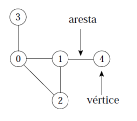
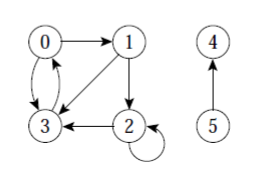
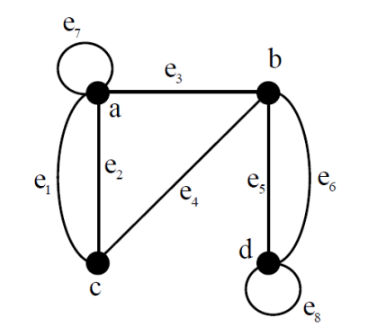
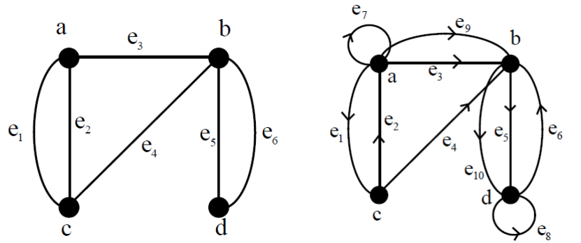

# Grafos

Conjunto de vértices e, frequentemente, arestas. Denotado por $G = (V,A)$

**Vértice:** objeto simples que pode ter nome e outros atributos.

**Aresta:** conexão entre dois vértices.

## Possíveis aplicações para os grafos

São exemplos de problemas passíveis de serem resolvidos por programas com uma modelagem em grafos:

- Localização de informação relevante na web;

- Descobrir os melhores casamentos entre posições disponíveis em empresas e pessoas que aplicaram para as posições de interesse;

- Descobrir qual é o roteiro mais curto para visitar as principais cidades de uma região turística.

## Grafos direcionados (Digrafos)

Os grafos aqueles descritos por um **par ordenado** $(V,A)$ onde $V$ é um conjunto finito de vértices e $A$ é uma <mark>relação binária em V</mark>.

- Quando uma aresta ($u,v$) sai do vértice $u$ e entra no vértice $v$, diz-se que o vértice $v$ é **adjacente** ao vértice $u$.

- *Self-loops* é a denominação dada à arestas de um vértice para ele mesmo.

Representação gráfica da fórmula matemática:

$G = (V,A)\\ V = {0,1,2,3,4,5}\\ A = \{(0,1), (0,3), (1,2), (1,3), (2,2), (2,3), (3,0), (5,4)\}$

## Grafos não direcionados

Grafo aquele onde o conjunto de arestas e pares de vértices não se encontram ordenados.

- Nestes as arestas $(u,v)$ e $(v,u)$ são tidas como a mesma aresta: a relação de adjacência é simétrica.

- *Self-loops não são permitidos*.

### Pseudografo

Grafos não direcionados em que *self-loops* são permitidos e ocorrem.

## Multigrafos

Grafos aqueles em que múltiplas arestas paralelas são permitidas.

## Grau de um Vértice

Para um dado vértice, trata-se do número de arestas que incidem sobre ele. Em um gráfico dirigido, conta-se tanto as arestas que saem dele (*out-degree*) quanto aquelas que chegam neste (*in-degree*).