# Anotações da aula 2

## Ciclos

Em um grafo não direcionado denomina-se um **ciclo** a sequência de vetores conectados entre si por pelo menos três arestas $(v_0, v_1, \dots, v_k)$, o *caminho*, em que $v_0 = v_k$. O ciclo é simples se todos os vértices do caminho são distintos entre si. No exemplo abaixo, nota-se que o caminho $(0,1,2,0)$ é um ciclo:

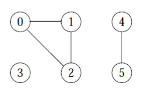

## Subgrafos

Para um dado grafo $G = (V,A)$ o grafo $G' = (V',A')$ é subgrafo deste se $V' \sube V$ e $A' \sube A$. No exemplo abaixo, o grafo à direita é subgrafo do grafo à esquerda:

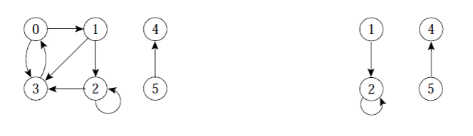

### Subgrafo próprio

Segue da definição de subgrafo que para qualquer grafo $G$, $G$ é subgrafo de si próprio. Assim distingue-se o $G'$ subgrafo de $G$ tal que $G' \not = G$ denominando-o um **subgrafo próprio**.

## Grafo conectado (ou conexo)

O grafo aquele onde qualquer par de vértices contidos neste encontra-se conectado por um caminho.

Por exemplo, o grafo $G$ seguinte não é conectado:

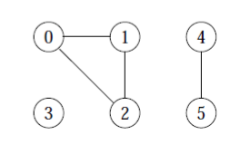

Mas se considerarmos apenas os subgrafos $\{0, 1, 2\}$ e $\{4,5\}$, teremos que cada um destes é um grafo conectado. Estes são **componentes conectados** (ou conexos) de $G$. No mais, estes são componentes conexos **maximais** pois cada um destes compõe a maior cadeia conexa a incorporar os vértices que estes integram.

### Componentes Fortemente Conectados

Um grafo **direcionado** é dito **fortemente conectado** se cada dois vértices quaisquer deste são alcançáveis a partir um do outro. Por extensão,

- os componentes conexos maximais de um grafo direcionado $G$ são também fortemente conectados.

- Um grafo direcionado fortemente conectado tem apenas um componente fortemente conectado

Por exemplo, no grafo

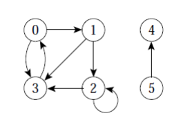

São os componentes fortemente conectados $\{0, 1, 2, 3\}$, $\{4\}$ e $\{5\}$. $\{4,5\}$ não o é pois o vértice 5 não é alcançável a partir do vértice 4.

## Grafos isomorfos

Grafos $G = (V,A)$ e $G' = (V', A')$ são isomorfos se existir uma bijeção $f:V \to V'$ tal que $(u,v) \in A$ se e somente se $(f(u), f(v)) \in A'$.

Noutras palavras, é possível re-rotular os vértices de G para serem rótulos de $G'$ mantendo as arestas correspondentes $G$ e $G'$:

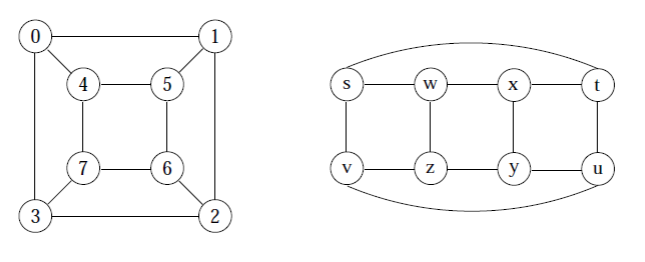

## Vizinhos e adjacentes

Em um grafo **direcionado**, um **vizinho** de um vértice é qualquer outro vértice que, na versão mão direcionada deste grafo estaria ligado a este por uma aresta. Por vez, um vértice adjacente é aquele que pode ser alcançado por um dado vértice meio de uma única aresta. Em gráficos não direcionados, não há distinção entre vértices vizinhos e adjacentes.

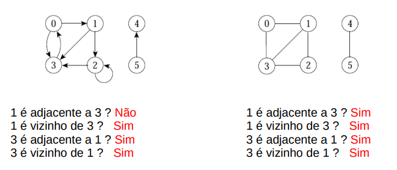

## Grafos completos

São os grafos não direcionados aqueles em que qualquer vértice encontra-se conectado por uma aresta a todos os demais.

- O número de arestas em um gráfico deste tipo é dado pela fórmula:

$$
\dfrac{|V|(|V| - 1)}2
$$

> Sendo $|V|$ o número de vértices.

- Enquanto o número total de grafos diferentes com $|V|$ vértices é dado por:

$$
|\mathcal P(G)| = 2^\frac{|V|(|V| - 1)}2
$$

## Grafo ponderado

Possui pesos associados às arestas

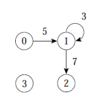

## Grafo transposto

O grafo $G'$ obtido a partir da inversão da direção das arestas de $G$.

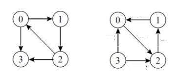

## Grafo Bipartido

Um grafo cujos vértices podem ser divididos em dois conjuntos disjuntos *U* e *V* tais que toda aresta conecta um vértice em *U* a um vértice em *V*;

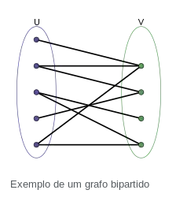

Equivalentemente, um grafo bipartido é um grafo que não contém qualquer ciclo de comprimento ímpar.

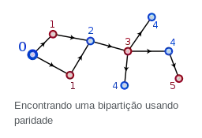

## Árvores

- **Árvore livre:** grafo não direcionado, acíclico e conectado. Comumente referido simplesmente enquanto "árvore" apenas.

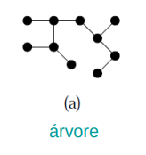

- **Floresta:** grafo não direcionado acíclico o qual pode, ou não, estar conectado.

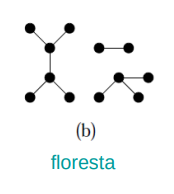

- **Árvore/Floresta Geradora:** o subgrafo $G = (V,A)$ que contém a totalidade dos vértices de $G$ que juntos compõem uma árvore/floresta.

## Matriz de adjacências

Representação de um grafo contendo $n$ vértices fazendo uso de uma matriz de dimensões $n \times n$.

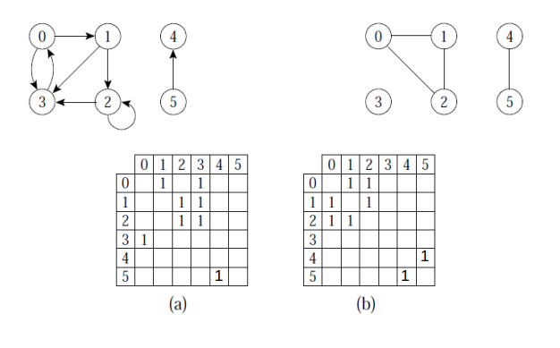