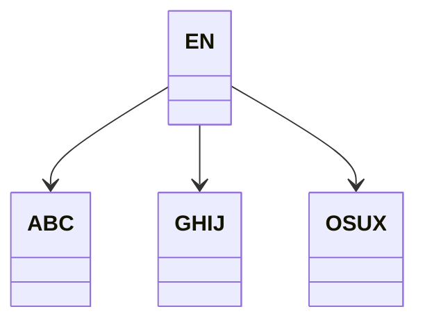
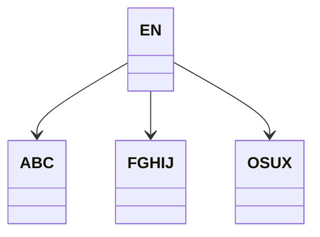
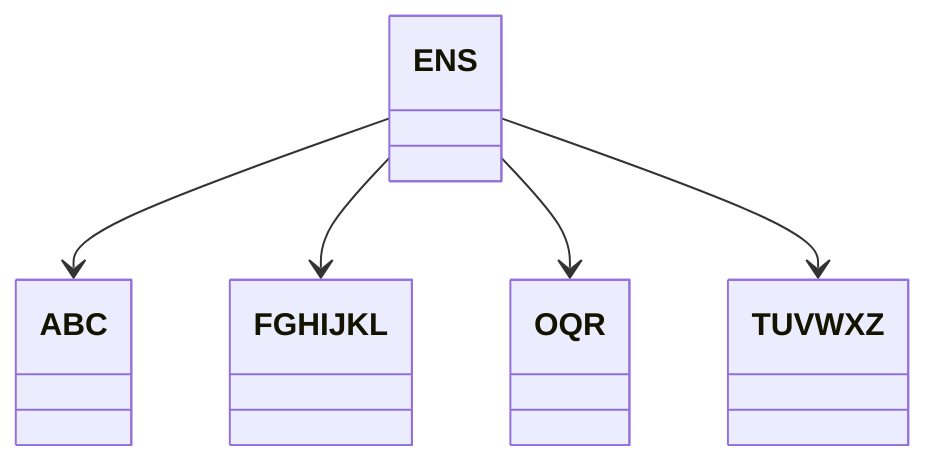

# Resolução Lista 2

## Q1.

**a.** Lista ligada: nesta estrutura, arquivos são relacionados entre si por ponteiros em uma ordem de precedência (o arquivo anterior aponta ao próximo). Assim, o acesso aos elementos é feito na ordem em que estes foram acrescentados à lista.

**b.** Tabela de hash: nesta estrutura arquivos são dispostos em um vetor de acordo com o valor que a chave destes produz como resultado de uma *função de hash* e, no caso de haverem colisões, *rehash*. O acesso ao conteúdo desta tabela é então feito diretamente na localização que estas funções apontam.

**c.** Vetor: nesta estrutura os arquivos são dispostos em uma porção sequencial de memória, a qual pode ser acessada por um índice que indica um deslocamento com relação ao início do vetor. O uso de um contador, então, permitiria acessar o conteúdo desta estrutura sequencialmente.

## Q2.

Em árvores binárias a inserção de novos nós se dá a partir das folhas; em árvores B, por outro lado, a inserção de novos nós ocorre na extremidade oposta: na raiz. Considerando uma representação piramidal da árvore, onde a raiz encontra-se no topo as folhas no fundo, vê-se o porque da construção da árvore se dar em sentidos opostos em cada caso.

## Q3.

```c
#include <stdbool.h>
#include <stdlib.h>


typedef struct node {
    int entries, *keys;
    bool leaf;
    struct node **child;
} Node;

typedef struct {
    int degree;
    Node *root;
} BTree;

Node *initNode(int degree, bool leaf) {
    int size = 2 * degree;
    Node *n = malloc(sizeof(Node));
    n->entries = 0;
    n->leaf = leaf;
    n->child = malloc(size * sizeof(int));
    n->keys = malloc((size - 1) * sizeof(Node *));
    return n;
}

BTree *initBTree(int degree) {
    BTree *b = malloc(sizeof(BTree));
    b->degree = degree;
    b->root = NULL;
    return b;
}
```

## Q4.

Seja o grau $t = 256$, então

**a.** $2t = 512$;

**b.** $t - 1 = 255$;

**c.** 1.

**d.**  0.

**e.** 199 chaves.

**f.** O nó raiz comporta $512$ chaves e $513$ ponteiros para nós que comportam uma mesma quantidade de chaves e filhos. Um novo nó raiz só é gerado assim que a raiz anterior e seus filhos estiverem todos lotados. Temos que $512 < 10^5 < 512 + 512 * 513 \implies 512 < 10^5 < 263,168$, logo a altura máxima de uma árvore, contando à partir de 1 é 2. $\blacksquare$

## Q5.

```c
int lowestKey(Node *root) {
    return (root->leaf) ? root->keys[0]
                        : lowestKey(root->child[0]);
}
```

## Q6.

Assume-se que por *ordem* e *grau* de uma árvore B nos referimos a um mesmo quociente.

**a.**


**b.**



**c.**



**d.**



## Q7. (Perguntar)

Tendo em vista que o acesso ao arquivo tenha de ser sequencial dado o fato deste encontrar-se desordenado, temos:

**a.** Melhor caso: 3, o índice para o arquivo se encontra na raiz da árvore, o ponteiro do registro encontra-se no início do arquivo, acessa-se o registro; Pior caso: $N + d + 1$, o índice para o arquivo encontra-se em um nó folha, o ponteiro do registro encontra-se no final do arquivo, acessa-se o registro.

**b.** Melhor caso: $3$, o índice para o arquivo encontra-se na raiz da árvore, adiciona-se o registro e acrescenta-se o ponteiro para este ao final do arquivo. Pior caso: $N + d + 2$, o índice para o arquivo encontra-se em um nó folha, adiciona-se o registro e acrescenta-se o ponteiro para este ao final do arquivo.

**c.** Melhor caso: $$

## Q8.

Ela é correta em função do método de inserção de novos nós na raiz, isso só ocorre se a raiz estiver cheia, o que por vez só ocorre quando todos os filhos desta estiverem cheios, e assim recursivamente. Tal qual visto no seguinte código:

```c
bool insertKey(Node **root, int degree, int key) {
    if (!*root)
        *root = initNode(degree, true);
    else if ((*root)->entries == 2 * degree - 1) {
        *root = insertRoot(*root, degree);
        return ((*root)->keys[0] < key)
                   ? insertNonFull(key, degree, (*root)->child[1])
                   : insertNonFull(key, degree, (*root)->child[0]);
    }
    return insertNonFull(key, degree, *root);
}
```

Sendo que um nó que possui `2 * degree - 1` elementos é considerado ser um nó cheio.

## Q9.

```c
#include <limits.h>
#define NONE INT_MIN

int searchKthElement(int k, Node *root, int *counter) {
    int i, kth;
    if (!root->leaf) {
        for (i = 0; i < root->entries; i++) {
            kth = searchKthElement(k, root->child[i], counter);
            if (kth != NONE)
                return kth;
            if ((*counter)++ == k)
                return root->keys[i];
        }
        return searchKthElement(k, root->child[i], counter);
    }
    for (i = 0; i < root->entries && k > *counter; i++)
        (*counter)++;
    return (i < root->entries) ? root->keys[i] : NONE;
}

int kthElement(int k, Node *root) {
    int counter = 0;
    return searchKthElement(k, root, &counter);
}
```

Melhor caso $O(1)$, busca-se exatamente o elemento mediano das chaves. Pior caso $O(c)$, onde c é o número de chaves, busca-se a última chave e percorre-se cada uma delas sequencialmente.