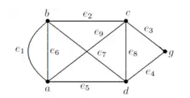

# Resolução da Lista "Grafos 1"

## Questão 1

**a. Grafo:** Um conjunto não vazio de objetos denominados **vértices** (ou nós) e **arestas**, um conjunto potencialmente vazio de pares de vértices.

**b. Dígrafo:** O grafo aquele em que as arestas possuem um sentido associado (indicado por uma seta na representação gráfica).

**c.**

- **Ordem:** número de arestas que incidem sobre um determinado vértice ou conjunto de vértices.

- **Adjacência:** relação estabelecida entre os vértices aqueles ligados por uma aresta.

- **Laço:** ocorrência de aresta que liga um dado vértice à ele próprio.

**d.** O que difere um grafo dirigido de um não dirigido é o fato de suas arestas possuírem orientação. No mais, laços só são possíveis de serem feitos e, um grafo do primeiro tipo.

**e.**

- **Cadeia simples:** A sequência de vértices ligados cada qual ao seguinte por uma aresta (cadeia) em que não ocorre repetição de arestas.

- **Cadeia elementar:** a cadeia em que, senão pela possível exceção dos vértices inicial e final, não ocorre a repetição de vértices.

**f. Comprimento de uma cadeia:** O número de arestas que compõem a cadeia.

**g. Caminho:** Sinônimo de cadeia.

**h. Ciclo:** O caminho aquele que possui como início e fim o mesmo vértice.

**i e j. Grafo conexo:** O grafo aquele em que é possível estabelecer um caminho ligando quaisquer vértices que o compõem.

Exemplo:



**k. Componentes conexas:** Conjunto de vértices pertencentes a um mesmo gráfico as quais encontram-se conexas entre si.

**l. Grafo fortemente conexo:** Um grafo **direcionado** é dito **fortemente conectado** se cada dois vértices quaisquer deste são alcançáveis a partir um do outro. Por extensão,

- os componentes conexos maximais de um grafo direcionado G são também fortemente conectados.

- Um grafo direcionado fortemente conectado tem apenas um componente fortemente conectado

## Questão 2

O grafo aquele **não direcionado**, **acíclico** e **conectado**.

## Questão 3

O grafo aquele capaz de ser representado graficamente em um plano sem que neste ocorra qualquer intersecção entre arestas.

## Questão 5

Por fazer

## Questão 6

Admitindo-se uma representação em matriz de adjacências e vértices numerados:

```
Imprime "→" (caractere tabular)
Para cada vértice v no grafo G
    Imprime "→v"
Imprime "↲" (quebra de linha)
Para cada vértice v no grafo G
    Imprime "→v"
    Para cada vértice u no grafo G, sendo u > v
        Imprime"→"
        Se u é adjacente à v
            Imprime "u"
    Imprime "↲"
```