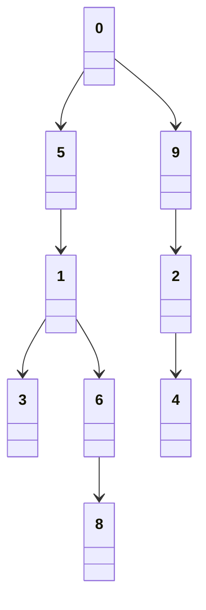
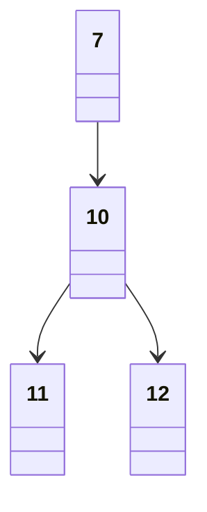

# Simulado: Resolução da prova A

## Questão 1

Seja a matriz de adjacência $M_{i \times j}$, tal que $i = j$ e $0 \le i$, representativa do dígrafo $G$, sendo o valor $1$ representativo da presença de uma aresta direcionada conectando o vetor $i$ ao $j$ e $0$ representativo da ausência desta, tem-se:

$$
M_{12 \times 12} = \left\{
\begin{matrix}
0 & 0 & 0 & 0 & 0 & 1 & 1 & 0 & 1 & 1 & 0 & 0 & 0\\
0 & 0 & 0 & 1 & 0 & 0 & 1 & 0 & 0 & 0 & 0 & 0 & 0\\
0 & 0 & 0 & 0 & 1 & 0 & 1 & 0 & 0 & 0 & 0 & 0 & 0\\
0 & 0 & 0 & 0 & 0 & 0 & 0 & 0 & 0 & 0 & 0 & 0 & 0\\
1 & 0 & 0 & 0 & 0 & 0 & 0 & 0 & 0 & 0 & 0 & 0 & 0\\
0 & 1 & 0 & 0 & 0 & 0 & 0 & 0 & 0 & 0 & 0 & 0 & 0\\
0 & 0 & 0 & 1 & 0 & 0 & 0 & 0 & 0 & 0 & 0 & 0 & 0\\
0 & 0 & 1 & 0 & 0 & 0 & 0 & 0 & 0 & 1 & 1 & 0 & 0\\
0 & 0 & 0 & 1 & 0 & 0 & 0 & 0 & 0 & 0 & 0 & 0 & 0\\
0 & 0 & 1 & 0 & 0 & 0 & 0 & 1 & 0 & 0 & 0 & 0 & 0\\
0 & 0 & 0 & 0 & 0 & 0 & 0 & 0 & 0 & 0 & 0 & 1 & 1\\
0 & 0 & 0 & 0 & 0 & 0 & 0 & 0 & 0 & 0 & 0 & 0 & 0\\
0 & 0 & 0 & 0 & 0 & 0 & 0 & 0 & 0 & 0 & 0 & 1 & 0
\end{matrix}\right\}
$$

> **Nota:** na representação textual do dígrafo estava faltando a aresta $(8,3)$, então esta matriz é representativa do diagrama do dígrafo.

## Questão 2

Seja $V = \{v_1, v_2, \dots, v_{12}\}$ o vetor das listas de adjacências $v$ do dígrafo $G$, em que cada $v_i = \{x_1, x_2, \dots, x_n\}$, sendo  cada $x$ um vetor conectado ao vetor $i$ por uma aresta, tem-se:

$$
V = \left\{
\{5, 6, 8, 9\},
\{3, 6\},
\{4, 6\},
\{\},
\{0\},
\{1\},
\{3\},
\{2, 9, 10\},
\{3\},
\{2\},
\{11, 12\},
\{\}, \{11\}
\right\}
$$

## Questão 3

$L = \{(0,8), (0,6,8), (0, 5, 1, 6, 8), (0, 9, 2, 6, 8)\}$

## Questão 4

Ao executarmos uma busca em profundidade  $(BP)$ tendo como vértice inicial o vértice 5 temos que todos os caminhos possíveis iniciados à partir deste terminam no vértice 3, sendo que nenhum destes passa pelo vértice 9. Tal qual o seguinte teste de mesa é capaz de demonstrar. Seja $(X, Y)$ um par ordenado onde $X$ é um vértice e $Y$ A aplicação da $BP$ ao conjunto de vértices ligados a este por uma aresta direcionada neste originada, temos, pela análise da matriz ou lista de adjacências acima que:

$$
BP(5) = (5,(1,(3, (6, (3, (8, 3))))))
$$

## Questão 5

$d = \{0, 2, 12, 3, 13, 1, 5, 18, 6, 11, 19, 20, 22\}\\
f = \{17, 10, 15, 4, 14, 10, 8, 25, 7, 16, 24, 21, 23\}
$

## Questão 6

$parnt = \{-1, 5, 9, 1, 2, 0, 1, -1, 6, 0, 7, 10, 10\}$

Onde o valor $-1$ indica que o vértice em questão não possui antecessor.

## Questão 7

Duas, com raiz nos vetores 0 e 7, respectivamente:

## Questão 8

O único **arco descendente** (aresta de avanço) é $0 \to 6$. Logo este é o primeiro e último arco deste tipo a ser descoberto.

## Questão 9

São os **arcos cruzados** dispostos na ordem em que estes são examinados:

$$
8 \to 3,\ 2 \to 6,\ 7 \to 9, 7 \to 2,\ 12 \to 11
$$

## Questão 10

São os **arcos de retorno** dispostos na ordem em que estes são examinados:

$$
4 \to 0,\ 12 \to 7
$$

## Questão 11

Basta que este passe a retornar "verdadeiro", ou imprima recursivamente os vértices percorridos, assim que este se depare com uma aresta de retorno. Feito desta forma, o primeiro ciclo a ser identificado no presente exemplo seria aquele do ciclo:

$$
0 \to 9 \to 2 \to 4 \to 0
$$

## Questão 12

Respectivamente, sim e não. Justifiquemos o primeiro caso. Imagine um grafo composto por três vértices, onde o primeiro acessa os demais, e o segundo acessa o terceiro. Teremos as seguintes arestas e respectivas classificações sendo feitas, conforme as definições de arestas e na ordem em que estas são examinadas:

- $1 \to 2$, aresta de árvore;

- $1 \to 3$, aresta de árvore;

- $2 \to 3$, aresta de cruzamento;

Agora,  se fossem acessados os vértices na ordem $2,3,1$, teríamos:

- $2 \to 3$ aresta de árvore;

- $1 \to 2$, aresta de cruzamento;

- $1 \to 3$, aresta de cruzamento.

Passemos ao segundo caso. Como visto na questão anterior, havendo vértice de retorno também há ciclo no grafo. O fato de que vértices são acessados em diferentes ordens não faz com que o grafo deixe de possuir determinadas arestas e portanto seus respectivos ciclos e, por conseguinte, a existência de arestas de retorno. Assim o sendo, embora a classificação da aresta enquanto aresta de retorno pode ser atribuída a outra aresta em função da ordem de acesso, havendo ciclo é inevitável que ocorra a classificação de *pelo menos uma* aresta enquanto uma aresta de retorno.