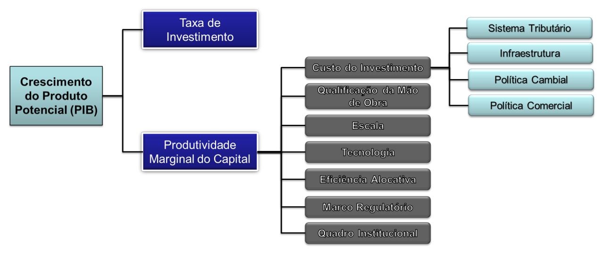

# Macroeconomia

O estudo do conjuntos dos fenômenos econômicos que têm, em seu cerne, o conflito entre as necessidades humanas que são, virtualmente, ilimitadas e a disponibilidade de recursos finitos para satisfazê-las.

## Conceitos preliminares

### PIB (Produto Interno Bruto), ou Oferta Agregada

A soma dos valores de todos os bens e serviços **finais** produzidos dentro das fronteiras de um país em um determinado período de tempo.

$$
PIB = P_1Q_1 + P_2Q_2 + P_3Q_3 + \dots + P_nQ_n
$$

Este pode ser aferido por três medidas diferentes:

- pela produção, somando-se o valor do que as firmas produzem;

- pela remuneração do fatores de produção (renda), pela soma dos salários, aluguéis, juros e lucros;

- pela demanda, pelo que foi gasto no consumo.

#### Alguns conceitos associados ao PIB

- **PIB Corrente:** a produção medida a preços correntes.

- **PIB Potencial:** a capacidade total de produção de uma economia.

- **PIB ppp (*Purchasing Power Parity*):** a produção do país medida a preços de mercadorias de um país de referência (frequentemente os EUA).

- **PIB real:** a razão PIB corrente / inflação.

- **PNB:** Produto Nacional Bruto = PIB - Renda Líquida Enviada ao Exterior (RLEE) + Renda Líquida Recebida do Exterior (RLRE).

#### Fatores de deslocamento do PIB

### Demanda Agregada (DA)

A demanda total de bens e serviços numa dada economia para um determinado nível de preços. De acordo com a hipótese keynesiana:

PIB = DA = Consumo + Investimento + Gastos do Governo + (Exportações - Importações)

> O índice (Exportações - Importações) é também denominado *Exportações Líquidas* ou *Transação Corrente*.

Sendo,

- **Consumo:** As despesas das famílias com bens e serviços, excetuando-se a aquisição de nova moradia.

- **Investimento:** Despesas com equipamentos, estoques, construções, tudo aquilo que produz um aumento físico da capacidade produtiva. Portanto, na Macroeconomia, aplicações em ações e produtos financeiros são parte da poupança, e não do investimento.

- **Gastos Governamentais:** Despesas com bens e serviços pelos governos federal, estadual e municipal. Não inclui transferências (como aposentadorias e pensões)

### Inflação

Denominação dada ao aumento contínuo e generalizado dos níveis de preços. A inflação pode ser propiciada por:

- Aumento na demanda;

- Aumento dos custos;

- Inércia (a expectativa de que algum dos fatores anteriores venha a se agravar);

São distorções causadas pela inflação:

- Aumento da desigualdade social;

- Perda da relatividade de preços;

- Inexistência de Crédito de longo prazo.

#### Monitoramento da Inflação

No Brasil é adotado um regime de metas de inflação dados índices de preços. Tais como 

##### IPCA-IBGE

O Índice de Preços ao Consumidor Amplo, reflete a variação mensal de preços para famílias com renda de até 40 salários mínimos, em 11 regiões metropolitanas mais o Distrito Federal.

##### IPC-FIPE

Mede a variação semanal nos últimos 30 dias, dos bens e serviços consumidos pelas famílias que ganham até 20 salários mínimos no Município de São Paulo.

##### IGP-FGV

O Índice Geral de Preços, é composto por três índices:

- **60%** pelo Índice de Preços por Atacado (IPA);

- **30%** pelo Índice de Preços ao Consumidor (IPC);

- **10%** pelo Índice Nacional do Custo da Construção (INCC).

O IGP sofre mais diretamente o efeito de variações cambiais, por incluir preços de insumos no atacado, que o IPCA.

## Balanço de Pagamentos

Registro contábil de todas as operações de um país com o exterior. É composto por três contas:

- Balança comercial (mercadorias, a exportação e importação anteriormente mencionados);

- Balança de serviços (turismo, juros, remessa de lucros, entre outros);

- Balança de capitais (empréstimos, investimentos);

Este apresenta dois tipos de transações:

- Autônomas (ou espontâneas): motivadas pelos interesses individuais de cada agente econômico (empresas, consumidores, governo, etc.);

- Compensatórias (ou induzidas): destinadas a quitar as contas do Balanço de Pagamentos.

### Poupança

Recursos disponíveis mas não utilizados para consumo. São fontes de popança:

- Famílias, quando a renda desta sobressai o consumo da mesma;

- O lucro das empresas;

- O Governo, quando a receita deste supera suas despesas;

- Investidores estrangeiros (poupança externa).

## Objetivos e Instrumentos de Política Econômica

### Objetivos

Podemos elencar 4 objetivos principais:

- **Crescimento da Produção (PIB):** Países de PIB elevado também possuem altos níveis de desenvolvimento humano;

- **Controle da Inflação:** para de precaver às distorções anteriormente mencionadas que esta provoca;

-  **Equilíbrio Externo:** Enquanto um déficit econômico pode levar a perda de reservas cambiais e eventualmente à moratória, um superávit mais prolongado leva a emissão de moeda (inflação) ou expansão da dívida interna (o que representa um risco). Tais situações extremas podem ser amelhoradas pela diversificação da pauta de exportação e dos parceiros comerciais.

- **Distribuição de Renda:** Preciso justificar?

### Instrumentos

Podemos elencar 4 instrumentos principais:

- **Política Fiscal**, decisões sobre gastos públicos e arrecadação tributária, incluso o déficit público e seu financiamento;

- **Política Monetária**, que inclui:
  
  - a quantidade de moeda na economia;
  
  - o volume e as condições de crédito;
  
  - as taxas de juros.

- **Política Cambial e de Comércio Exterior**, como o sistema cambial adotado, impostos sobre a importação ou incentivos à exportação.

- **Política de Rendas:** as políticas de bem-estar social (welfare state).