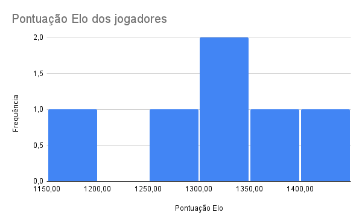
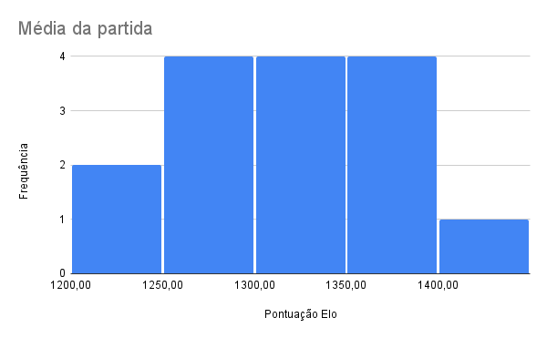
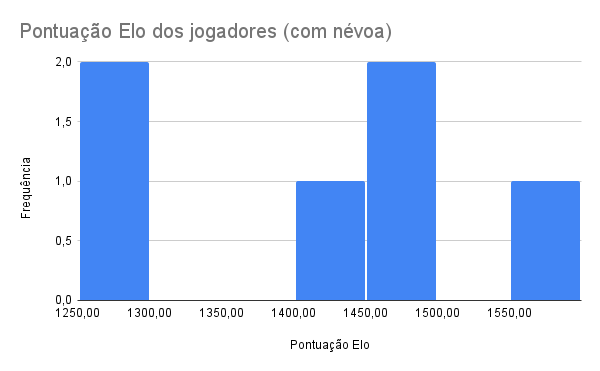
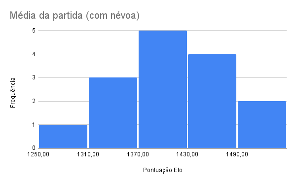

# Exercício solicitado

> Feito por Guilherme de Abreu Barreto (nUSP: 12543033) e Marcus Imazava Gianini (nUSP: 12717669)

## Premissa

Neste exercício, avaliaremos dados acerca da jogadores de [TinyWars](https://tinywars.online/game/legacy). Tinywars é um jogo de estratégia em turnos de [soma zero](https://en.wikipedia.org/wiki/Zero-sum_game), semelhante ao Xadrez. Também como este último, este avalia seus jogadores nas partidas classificatórias de acordo com uma [pontuação Elo]([Elo rating system - Wikipedia](https://en.wikipedia.org/wiki/Elo_rating_system)), em duas modalidades de jogo: com e sem [Névoa da Guerra]([Fog of war - Wikipedia](https://en.wikipedia.org/wiki/Fog_of_war#Simulations_and_games)).

Tomemos como população seis jogadores distintos, que estejam pontuados em ambas modalidades, a participar dos jogos classificatórios mais recentes. Com isso, temos:

| Jogador | Elo (sem névoa) | Elo (com névoa) |
| ------- | --------------- | --------------- |
| 1       | 1300            | 1262            |
| 2       | 1178            | 1483            |
| 3       | 1285            | 1288            |
| 4       | 1378            | 1421            |
| 5       | 1329            | 1474            |
| 6       | 1442            | 1551            |

Selecionemos aleatoriamente um par destes, uma amostra aleatória sem reposição, fossem estes jogadores jogar uma partida, qual seria o Elo médio observado nesta e o desvio padrão da pontuação destes jogadores com relação a esta média?

## Análise Estatística

### Sem névoa

#### Distribuição amostral da média

| Jogadores | 1   | 2    | 3      | 4      | 5      | 6      | Total |
| ---------:| ---:| ----:| ------:| ------:| ------:| ------:| -----:|
| **1**     | ⟍   | 1281 | 1292,5 | 1339   | 1214,5 | 1371   | 5/15  |
| **2**     |     | ⟍    | 1231,5 | 1278,5 | 1253,5 | 1310   | 4/15  |
| **3**     |     |      | ⟍      | 1331,5 | 1307   | 1363,5 | 3/15  |
| **4**     |     |      |        | ⟍      | 1353,5 | 1410   | 2/15  |
| **5**     |     |      |        |        | ⟍      | 1385,5 | 1/15  |
| **6**     |     |      |        |        |        | ⟍      | 0     |
| **Total** | 0   | 1/15 | 2/15   | 3/15   | 4/15   | 5/15   | 1     |

Com estes valores em faixas de pontuação de amplitude de 50 pontos podemos desenhar o seguintes histogramas:

#### Desvio Padrão

O desvio padrão ($S$) desta amostra pode ser obtido pela raiz quadrada da variância ($S^2$) desta que, por vez, é derivada à partir dos valores observados $X_i$ e a média amostral $\overline X$. Temos que:

$$
\overline X =
\dfrac{\sum^n_{i = 1}X_i}{n} = \dfrac{1300 + 1178 + \dots + 1329 + 1442}6 =
1318,\overline 6
$$

$$
S^2 = \dfrac{\sum^n_{i = 1}(X_i - \overline X)^2}{n - 1}= \\\ \\
\dfrac{(1300 - 1318,\overline 6)^2 +
(1178 - 1318,\overline 6)^2 + \dots + 
(1442 - 1318,\overline 6)^2}5 = 8022,\overline 6
$$

$$
\therefore S = \sqrt{S^2} \approx 89,56\ \blacksquare
$$

### Com névoa

#### Distribuição amostral da média

| Jogadores | 1   | 2      | 3      | 4      | 5      | 6      | Total |
| ---------:| ---:| ------:| ------:| ------:| ------:| ------:| -----:|
| **1**     | ⟍   | 1372,5 | 1275   | 1341,5 | 1368   | 1406,5 | 5/15  |
| **2**     |     | ⟍      | 1385,5 | 1452   | 1478,5 | 1517   | 4/15  |
| **3**     |     |        | ⟍      | 1354,5 | 1381   | 1419,5 | 3/15  |
| **4**     |     |        |        | ⟍      | 1447,5 | 1486   | 2/15  |
| **5**     |     |        |        |        | ⟍      | 1512,5 | 1/15  |
| **6**     |     |        |        |        |        | ⟍      | 0     |
| **Total** | 0   | 1/15   | 2/15   | 3/15   | 4/15   | 5/15   | 1     |

#### Desvio Padrão

Aplicando-se as mesmas fórmulas vistas no cálculo do desvio padrão para partidas sem névoa, obtemos

$$
\overline X = 1413,2 \\ S^2 = 13231\\ S \approx 115,03
$$

## Conclusão

Vemos que em ambos os casos o Elo médio das partidas tende a assumir uma distribuição normal. O valor médio para partidas sem névoa é inferior aquele com névoa, indicando que os jogadores demonstrariam melhor desempenho na segunda modalidade de jogo. Entretanto, o desvio padrão na segunda modalidade também é maior, indicando que as partidas na segunda modalidade provavelmente demonstrariam ser mais desbalanceadas, com maior dominância dos jogadores de maior habilidade.