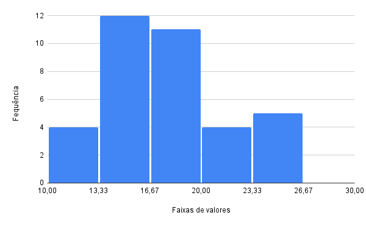
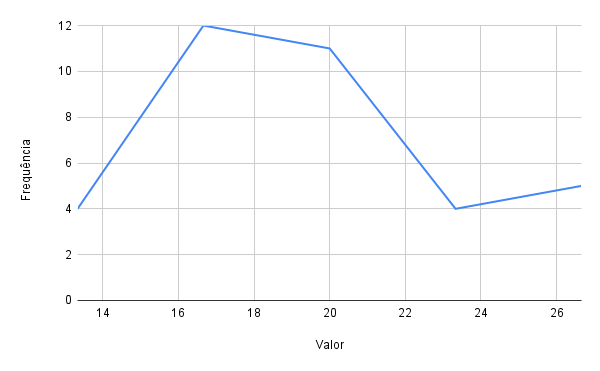
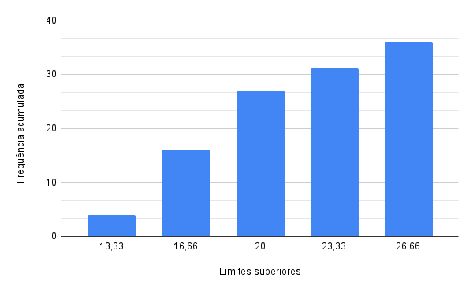

# Resolução da lista de exercícios 1 da disciplina de Introdução à Estatística

> Feita por Guilherme de Abreu Barreto; nUSP 12543033.

## Questão 1

Para cada uma das amostras abaixo, informar o tipo do processo de amostragem:

P ‒ Amostragem probabilística ‒, ou NP ‒ Amostragem não probabilística

Para uma pesquisa sobre os hábitos dos estudantes. Construí uma amostra com
o seguinte procedimento:

1. Todos os meus colegas da faculdade (tenho telefone e email de todos eles).

2. Fiquei na única porta de entrada da escola abordando todos os meus
   conhecidos.

3. Fiquei na única porta de entrada da escola e cada 12 pessoas que
   entravam, eu abordava uma.

4. Consegui uma lista de todos os alunos das escolas com uma
   ordenação aleatória, e selecionei os 20 primeiros da lista.

5. Consegui uma lista de todos os alunos das escolas em ordem
   alfabética. Gerei 20 números aleatórios. Selecionei da lista de alunos
   aqueles que ocupavam posições equivalentes aos números aleatórios
   gerados.

### Resolução

Entende-se por amostragem probabilística:

> Uma amostra aleatória simples de tamanho $n$ de uma variável aleatória $X$, com dada distribuição, é o conjunto de $n$ variáveis aleatórias independentes $X_1, X_2, \dots, X_n$, cada uma com a mesma distribuição de $X$.
> 
> Ou seja, a amostra será a $n$-upla ordenada ($X_1, X_2, \dots, X_n$), onde $X_i$ indica a observação do $i$-ésimo elemento sorteado. (BUSSAB, W.; MORENTTIN, P., p. 269)

Assim o sendo, corrobora a definição anterior os casos descritos nos itens 2 à 5. Resta que o item 1 trata-se de uma amostra não probabilística.

## Questão 2

Um estudo sobre o desempenho dos vendedores de uma grande cadeia de lojas
de varejo está sendo planejado. Para tanto, deve ser colhida uma amostra
probabilística dos vendedores. Classifique cada uma das amostras abaixo
conforme a seguinte tipologia:

(**A**) Amostragem casual simples
(**B**) Amostragem Sistemática
(**C**) Amostragem estratificada
(**D**) Amostragem por meio de conglomerados

1. Lista de todos os vendedores (que atuam em todas as lojas da rede). Selecionei todos os vendedores que ocupavam posições múltiplas de 15 (15ª posição, 30ª posição, 45ª posição, 60ª posição, 75ª posição, 90ª posição, 105ª posição, etc).

2. Escolhi casualmente 3 lojas da rede. A amostra foi composta de todos os vendedores que atualmente em cada uma destas 3 lojas.

3. Em cada uma das lojas, identifiquei todos os vendedores (lista de vendedores por loja). Selecionei aleatoriamente k vendedores da loja. Onde k é um número inteiro proporcional à quantidade de vendedores da loja.

4. Lista de todos os vendedores (que atuam em todas as lojas da rede). Selecionei aleatoriamente $N$ vendedores.

### Resolução

Retomemos as definições dos diferentes tipos de amostragem:

- *Amostragem Aleatória Simples (AAS)* [o que tomaremos por "amostragem casual simples"]:

> Nesse plano as $n$ unidades que compõem a amostra são selecionadas de tal forma que todas as possíveis amostras têm a mesma probabilidade de serem escolhidas. (Ibidem, p. 293)

- Amostragem sistemática:

> Nesse plano, supõe-se que temos uma listagem das unidades populacionais. Para $k$ fixado, sorteamos um elemento entre os $k$ primeiros da listagem. Depois observamos, sistematicamente, indivíduos separados por $k$ unidades. Por exemplo, se $k = 10$ e sorteamos o oitavo elemento, observamos depois o décimo oitavo, vigésimo oitavo etc. (Ibidem, p. 294)

- Amostragem estratificada:

> Nesse procedimento, a população é dividida em subpopulações ou estratos, usualmente de acordo com os valores (ou categorias) de
> uma variável, e depois AAS é utilizada na seleção de uma amostra de cada estrato. (Ibidem, p. 293)

- Amostragem por meio de Conglomerados:

> A população é dividida em grupos (subpopulações) distintos, chamados conglomerados. Por exemplo, podemos dividir uma cidade em bairros ou quadras. Usamos *AAS* para selecionar uma amostra de conglomera-
> dos e depois todos os indivíduos dos conglomerados selecionados são analisados. (Loc. Cit.)

Portanto, temos a correlação: **1-B, 2-D, 3-C, 4-A**.

## Questão 3

Com a amostra abaixo, construa um histograma, polígono de frequência e gráfico de frequência acumulada. (Classes de frequência)

| 18,9 | 15,8 | 17,0 | 12,6 |
| ----:| ----:| ----:| ----:|
| 24,2 | 18,9 | 16,1 | 16,4 |
| 17,8 | 15,9 | 17,6 | 12,9 |
| 26,2 | 18,6 | 18,7 | 17,6 |
| 21,7 | 17,8 | 14,0 | 20,3 |
| 23,5 | 16,0 | 23,5 | 14,1 |
| 22,3 | 16,1 | 18,1 | 14,4 |
| 25,0 | 13,4 | 16,8 | 12,7 |
| 12,6 | 15,2 | 20,2 | 15,2 |

### Resolução

#### Histograma

#### Polígono de frequência

#### Gráfico de frequência acumulada

## Questão 4

Considere o resumo dos dados de uma amostra abaixo (classes de frequência). Determine:

(a) Média

(b) Moda

(c) Mediana

(d) Variância

(e) Desvio padrão

(f) Coeficiente de variação

| Classes     | Valor ($x_i$) | Frequência ($f_i$) | Frequência acumulada ($F_i$) |
| ----------- | ------------- | ------------------ | ---------------------------- |
| 4,7 ⊢ 6,9   | 5,8           | 1                  | 1                            |
| 6,9 ⊢ 9,1   | 8,0           | 4                  | 5                            |
| 9,1 ⊢ 11,3  | 10,2          | 16                 | 21                           |
| 11,3 ⊢ 13,5 | 12,4          | 41                 | 62                           |
| 13,5 ⊢ 15,7 | 14,6          | 72                 | 134                          |
| 15,7 ⊢ 17,9 | 16,8          | 100                | 234                          |
| 17,9 ⊢ 20,1 | 19,0          | 74                 | 308                          |
| 20,1 ⊢ 22,3 | 21,2          | 43                 | 351                          |
| 22,3 ⊢ 24,5 | 23,4          | 10                 | 361                          |
| 24,5 ⊢ 26,7 | 25,6          | 3                  | 364                          |
| Total       |               | 364                |                              |

### Resolução

Os cálculos para obtenção dos resultados abaixo foram feitos na seguinte [tabela](https://docs.google.com/spreadsheets/d/1hGlO72xL7xX1nHS-8ksMSWlMCcBb8dteGDpAMpVz9V0/edit?usp=sharing).

**a.** $M \approx 16,67307692$

**b.** $Mo = 16,8$

**c.** $Me = 16,8$

**d.** $V \approx 11,32597844$

**e.** $D \approx 3,365409105$

**f.** $C_V \approx 0,2018469129$

## Referências

BUSSAB, W.; MORENTTIN, P. **Estatística Básica**. 9. ed. São Paulo: Saraiva, 2017.

DE JESUS, I. **Desvio padrão variância e coeficiente de variação: Dados agrupados em tabela com intervalos de classe**, 24 nov. 2020. Disponível em: <https://invidious.privacy.gd/watch?v=Jw1clBBhxYE>. Acesso em: 23 mar. 2022

MURAKAMI, M. **MEDIDAS DE DISPERSÃO: VARIÂNCIA E DESVIO PADRÃO 2**, 11 set. 2019. Disponível em: <https://invidious-us.kavin.rocks/watch?v=OHEcOM6zryE>. Acesso em: 23 mar. 2022
