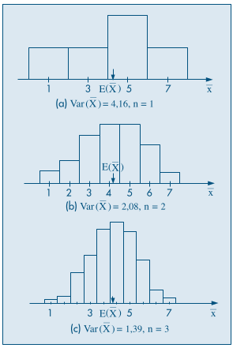

# Introdução à Inferência Estatística

## População e Amostra

Por **população**, referimo-nos a um conjunto de elementos sobre is quais busca-se saber seus parâmetros (de distribuição, como a média e a variância). Por **amostra**, referimo-nos a um subconjunto desta população cujos parâmetros provêm uma estimativa dos parâmetros da população. Assim, na impossibilidade de se obter os parâmetros da população, é possível recorrer à uma estimativa destes aferida pela amostra (uma inferência estatística) que, idealmente, é representativa da totalidade do conjunto.

### Amostra aleatória simples

O conjunto de $n$ variáveis aleatórias independentes $X_1, X_2, \dots, X_n$, cada qual com a mesma distribuição de $X$.

## Estatísticas e Parâmetros

Uma **estatística** é uma característica da **amostra**, as mais comuns são:

- Média

- Variância

- Mínimo

- Máximo

- Amplitude

Ou seja uma estatística $T$ é uma função de $X_1, X_2, \dots, X_n$.

Um **parâmetro** é uma medida usada para descrever uma característica da **população**. Ou seja, o problema da inferência estatística é fazer uma afirmação sobre os **parâmetros** (da população) através da amostra.

## Teorema do Limite Central (TLC)

A **média das médias amostrais** $E(\overline X)$ coincide com a **média populacional** $\mu$, enquanto a variância $Var(\overline X)$ é igual à variância da população $\sigma^2$ dividida pelo tamanho da amostra $n$.

$$
E(\overline X) = \dfrac{E(X_1) + E(X_2) + \dots + E(X_n)}n =
\dfrac{\mu + \mu + \dots + \mu}n = n\ \dfrac \mu n = \mu
$$

$$
Var(\overline X) = \dfrac{Var(X_1) + \dots + Var(X_n)}{n^2} = n\ \dfrac{\sigma^2}{n^2} = \dfrac{\sigma^2}{n}
$$

### Exemplo

Para a população $\{1,3,5,5,7\}$ tem-se média $\mu = \frac{1 + 3 + 5 + 5 + 7}5 = 4,2$ e variância $\sigma^2 = \frac{(1 - 4,16)^2 + (3 - 4,16)^2 + \dots + (7 - 4,16)^2}5 = 4,16$. Construindo-se um histograma das distribuições amostrais de tamanho $n = 1, 2$ e $3$ respectivamente, tem-se:

Observa-se que, conforme $n$ aumenta, o histograma tende a concentrar-se em torno de $E(\overline X) = E(X) = 4,2$, já que a variância tende à zero. Ou seja, para $n$ suficientemente grande, a distribuição da amostra tende a uma **distribuição normal**.

### Corolário

Se $(X_1, X_2, \dots, X_n)$ for uma amostra aleatória simples da população $X$, com média $\mu$, variância $\sigma^2$ finita, e $\overline X = (X_1 + X_2 + \dots + X_n) \div n$, então

$$
Z = \dfrac{\overline X - \mu}{\frac \sigma{\sqrt n}} =
\dfrac{\sqrt n (\overline X - \mu)}\sigma \sim N (0,1)
$$

Basta notar que se usou a transformação usual de reduzir a distribuição de $\overline X$ a uma normal padrão.