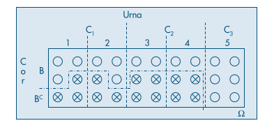
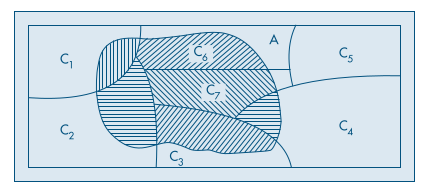

# Capítulo 5.4: Teorema de Bayes

Em teoria das probabilidades e estatística, o **teorema de Bayes** (ou lei de Bayes, ou regra de Bayes) descreve a **probabilidade condicional** de um evento, baseado em um conhecimento *a priori* que pode estar relacionado ao evento. O teorema mostra como alterar as probabilidades *a* *priori* tendo em vista novas evidências para obter probabilidades *a posteriori*, de forma a expressar como a probabilidade de um evento (ou o grau de crença na ocorrência de um evento) deve ser alterada após considerar evidências sobre a ocorrência deste evento. A versão mais simples desse teorema é dada pela fórmula:

$$
P(A|B) = \dfrac{P \cap B}{P(B)} = \dfrac{P(A)\cdot P(B|A)}{P(B)}
$$

## Exemplo

Temos cinco urnas, cada uma com seis bolas. Duas dessas urnas (tipo $C_1$) têm 3 bolas brancas, duas outras (tipo $C_2$) têm 2 bolas brancas, e a última urna (tipo $C_3$) tem 6 bolas brancas. Escolhemos uma urna ao acaso e dela retiramos uma bola. Qual a probabilidade de a urna escolhida ser do tipo $C_3$, sabendo-se que a bola sorteada é branca? Ou seja, estamos buscando $P(C_3 | B)$, sabendo que

$$
\begin{matrix}
P(C_1) = 2/5, & P(B | C_1) = 1/2, \\
P(C_2) = 2/5, & P(B | C_2) = 1/3, \\
P(C_3) = 1/5, & P(B | C_3) = 1/1.
\end{matrix}
$$

Da definição de probabilidade condicional, temos:

$$
P(C_3 | B) = \dfrac{P(C_3) P (B | C_3)}{P(B)}
$$

Resta encontrar o valor de $P(B)$, já que aquele do numerador já passível de ser obtido. Como $C_1$, $C_2$ e $C_3$ são eventos mutuamente exclusivos, e reunidos compõem o espaço amostral completo de bolas brancas, podemos decompor o evento B como sendo a reunião de três outros:

$$
B = (C_1 \cap B) \cup (C_2 \cap B) \cup (C_3 \cap B)
$$

Ou seja,

$$
P(B) = \dfrac 25 \cdot \dfrac 12 + \dfrac 25 \cdot \dfrac 13 + \dfrac 15 \cdot 1 = \dfrac 8{15}
$$

Substituindo este resultado na fórmula, obtemos:

$$
P(C_3 | B) = \dfrac{\dfrac 15 \cdot 1}{\dfrac 8{15}} = \dfrac 38\ \blacksquare
$$

### Corolário

Podemos generalizar o resultado anterior da seguinte forma: sejam $\{C_1,C_2, \dots, C_n\}$ partições de um espaço amostral $\Omega$, e para um evento qualquer $A$ são conhecidas as probabilidades $P(C_i)$ e $P(A|C_i)$ para $i = 1, 2, \dots, n$, então:

$$
P(C_i | A) = \dfrac{P(C_i) \cdot P(A | C_i)}
{\sum^n_{j = 1} P(C_j) \cdot P(A|C_j)}
$$

Tal qual ilustra o seguinte diagrama:

