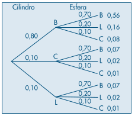
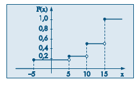

# Variáveis Aleatórias Discretas

Uma **variável aleatória** trata-se de uma variável quantitativa, cujo resultado (valor) depende de fatores aleatórios. Ainda, esta é denominada **discreta** quando esta pode assumir valores que podem ser contados. São exemplos de variáveis aleatórias discretas:

- O lançamento de dados de seis lados é um exemplo de **variável aleatória discreta finita**. O dado fornece um valor inteiro em todos os lançamentos, de modo que não existe a possibilidade de ele cair de lado e fornecer um valor fracionário como 2,5555;

- Já o número de carros que passam por um pedágio é um exemplo de **variável aleatória discreta infinita**. Pode-se passar uma infinidade de carros, porém nunca passará a metade de um carro por um pedágio (não haverá frações no número de carros que passarão por um pedágio).

Chama-se **função de probabilidade** da v.a. discreta $X$, que assume os valores $x_1, x_2, \dots, x_n$ a função $\{(x_i, p(x_i)) \mid i = 1, 2, \dots \}$, que a cada valor de $x_i$ associa a sua probabilidade de ocorrência, isto é,

$$
P(x_i) = P(X = x_i) = p_i, i = 1, 2, \dots
$$

## Valor médio de uma variável aleatória

Dada uma v.a. discreta $X$, assumindo os valores $x_1, \dots, x_n$, chamamos valor médio ou esperança matemática de $X$ o valor

$$
E(X) = \sum^n_{i = 1}x_i \cdot P(x_i)
$$

### Exemplo

considere um empresário que pretende estabelecer uma firma para montagem de um produto composto de uma esfera e um cilindro. As partes são adquiridas em fábricas diferentes (A e B), e a montagem consistirá em juntar as duas partes e pintá-las. O produto acabado deve ter o comprimento (definido pelo cilindro) e a espessura (definida pela esfera) dentro de certos limites, e isso só poderá ser verificado após a montagem. Para estudar a viabilidade de seu empreendimento, o empresário quer ter uma ideia da distribuição do lucro por peça montada.

Sabe-se que cada componente pode ser classificado como **bom**, **longo** ou **curto**,
conforme sua medida esteja dentro da especificação, maior ou menor que a especificada, respectivamente. Além disso, foram obtidos dos fabricantes o preço de cada componente ($5,00) e as probabilidades de produção de cada componente com as características bom, longo e curto.

| Produto                                | Fábrica A (Cilindro) | Fábrica B (Esfera) |
| -------------------------------------- | -------------------- | ------------------ |
| Dentro das especificações (B, bom)     | 0,8                  | 0,7                |
| Maior que as especificações (L, longo) | 0,1                  | 0,2                |
| Menor que as especificações (C, curto) | 0,1                  | 0,1                |

> Distribuição da produção das fábricas A e B, de acordo com as medidas das peças produzidas.

> Diagrama de árvore indicando probabilidade $p(x)$, tal que $0 \le p(x) \le 1$, de cada evento.

Se o produto final apresentar algum componente com a característica C (curto), ele será irrecuperável, e o conjunto será vendido como sucata ao preço de \$5,00. Cada componente longo poderá ser recuperado a um custo adicional de \$5,00. Se o preço de venda de cada unidade for de \$25,00, a distribuição de frequências da variável $X$ ‒ lucro por conjunto montado ‒ será:

| Produto | Probabilidade | Lucro por montagem (X) |
| ------- | -------------:| ----------------------:|
| BB      | 0,56          | 15                     |
| BL      | 0,16          | 10                     |
| BC      | 0,08          | -5                     |
| LB      | 0,07          | 10                     |
| LL      | 0,01          | 5                      |
| LC      | 0,01          | -5                     |
| CB      | 0,07          | -5                     |
| CL      | 0,02          | -5                     |
| CC      | 0,01          | -5                     |

Aglutinando estas probabilidades em função do Lucro por montagem, tem-se:

| x     | p(x) |
| -----:| ----:|
| 15    | 0,56 |
| 10    | 0,23 |
| 5     | 0,02 |
| -5    | 0,19 |
| Total | 1,00 |

Uma pergunta que logo ocorreria ao empresário é qual o lucro médio por conjunto montado que ele espera conseguir. Observamos que 56% das montagens devem produzir um lucro de 15 reais, 23% um lucro de dez reais, e assim por diante. Logo, o lucro esperado por montagem será dado por

$$
E(X) = \sum^n_{i = 1}x_i \cdot p(x_i) = -5 \cdot p(-5)
+ 5\cdot p(5) + 10 \cdot p(10) + 15 \cdot p(15)\\ =
-5 (0,19) + 5(0,02) + 10 (0,23) + 15 (0,56) = 9,85
$$

## Variância e Desvio Padrão de uma variável aleatória discreta

$$
\text{Var}(x) = \sum^n_{i = 0}[x_i - E(x)]^2p_i
$$

Enquanto o desvio padrão de $X$, $DP(X)$ é a raiz quadrada positiva da variância.

## Algumas propriedades do valor médio

Suponhamos que todos os preços $z$ do exemplo anterior estivessem errados pela mesma razão: na verdade estes valem o dobro  $2x$ do que foi descrito. O valor da esperança pode ser ajustado simplesmente ajustando o valor de $x_i$ na equação:

$$
E(Z) = \sum z_ip(z_i) = \sum (2x_i)p(x_i) = 19,70
$$

O mesmo é verdade para qualquer função $h(x)$ sobre o valor de $x$.

$$
E[h(x)] = \sum h(x_i)p(x_i)
$$

Seja $h(x) = aX + b$, onde $a$ e $b$ são constantes, então

- $E(aX + b) = aE(X) + b$;

- $\text{Var}(aX + b) = a^2\text{Var}(X)$

- $\displaystyle \text{Var}(X) = E(X^2) - [E(X)]^2 = \sum x^2_ip(x_i) - \left[ \sum x_ip(x_i) \right]^2$

## Função de Distribuição Acumulada

Dada a variável aleatória $X$, chamaremos de **função de distribuição acumulada** (f.d.a.), ou simplesmente **função de distribuição** (f.d.) $F(x)$ à função

$$
F(x) = P(X \le x)
$$

### Exemplo

Dada a situação supracitada do empresário buscando estabelecer seu negócio, temos que a f.d.a. pode ser expressa pelo seguinte gráfico:

> f.d.a. para a v.a. X= lucro por montagem.

Perceba que o domínio de $F$ é o conjunto dos números reais, enquanto o contradomínio é apenas o intervalo [0,1].

## Alguns Modelos Probabilísticos para Variáveis Aleatórias Discretas

### Distribuição Uniforme Discreta

O caso em que cada valor possível ocorre com a mesma probabilidade.

$$
P(X = x_i) = p(x_i) = p = \frac 1k
$$

Para todo $i = 1, 2, \dots, k.$

### Distribuição (ou ensaio) de Bernoulli

Quando a variável aleatória $X$ assume apenas os valores 0 ou 1, com função de probabilidade tal que

$$
f(x,p(x)) = \begin{cases}p(0) = P(X = 0) = 1- p \\
p(1) = P(X = 1) = p\end{cases}
$$

Segue-se facilmente que

$$
E(X) = p;\ Var(X) = p - p^2;\ F(X) =
\begin{cases}\begin{matrix}
0, & \text{se } x< 0\\
1 - p, & \text{se } 0 \le x \lt 1\\
1, & \text{se } x \ge 1.
\end{matrix}\end{cases}
$$

### Distribuição Binomial

Chama-se de experimento binomial o experimento em que

- Ocorrem $n$ ensaios de Bernoulli;

- cada qual independente dos demais; e

- para o qual a probabilidade de sucesso de cada ensaio é sempre igual a $p$, $0 \lt p \lt 1$.

Seja $q$ a probabilidade de insucesso, $q = 1 - p$, tem-se que:

$$
E(X) = np;\ Var(X) = npq
$$

E a probabilidade de quaisquer $k$ sucessos em $n$ ensaios é igual à:

$$
P(X = k \mid n, p) = \binom n k p^kq^{n - k} =
\left(\frac{n!}{k!(n - k)!}\right) p^kq^{n - k}
$$

Nota: por vezes $P(X = k \mid n, p)$ é denotado simplesmente por $b(k; n, p)$.

### Distribuição hipergeométrica

Semelhante à distribuição binomial, mas nesta os ensaios de Bernoulli não são independentes entre si pois, ao extrairmos um elemento da amostra, este não é reposto nas extrações subsequentes.

Sendo $N$ a população de objetos, $r$ dos quais possuem um atributo a ser encontrado e $n$ o tamanho da amostra, a probabilidade $p_k$ de se encontrar na amostra $k$ elementos com a propriedade característica de $r$ é dada por:

$$
p_k = \frac{\binom rk \binom{N - r}{n - k}}{\binom Nn}
$$

Segue que se $N$ for muito grande se comparado a $n$, $p_k \simeq b(k;\ n,p)$. Pode-se demonstrar que a v.a. X definida desta forma tem esperança e variância dadas por

$$
E(X) = np;\ Var(X) = np(1 - p) \frac{N - n}{N - 1}
$$

Sendo $p = \frac rN$. Denota-se a distribuição hipergeométrica de $X$ por

$$
X \sim \text{hip}(N, r, n)
$$

### Distribuição de Poisson

A distribuição de probabilidade de uma variável aleatória discreta que expressa a probabilidade de um dado evento (como um sucesso ou falha), ou série de eventos, ocorrer dado um certo **período de tempo** dado que estes eventos ocorrem de maneira **independente** entre si. Essa é expressa por:

$$
f(k;\lambda) = \frac{\lambda^k}{k!\ e^{\lambda}}
$$

Sendo:

- $\lambda$ um número real igual ao número esperado de ocorrências em um dado intervalo de tempo. Por exemplo, se o evento ocorre em média uma vez a cada 4 minutos e estamos interessados no número de eventos que ocorrem num intervalo de 10 minutos, $\lambda = \frac{10}4$.

- $k$ um dado número de ocorrências;

- e portanto $f(k;\lambda)$ é a probabilidade deste número de ocorrências acontecer no intervalo de tempo considerado por $\lambda$.