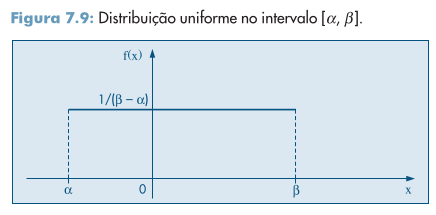
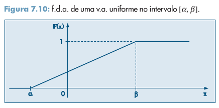
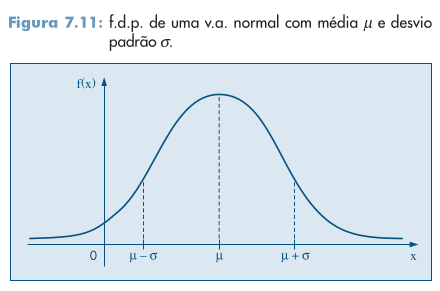
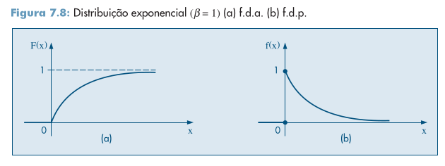

# Capítulo 7: Variáveis Aleatórias Contínuas

## Definição

Uma função $X$, definida sobre o espaço amostral $Ω$ e assumindo valores num intervalo de números reais, é dita uma variável aleatória contínua. Nestas condições, a probabilidade da variável $X$ assumir valores entre $a$ e $b$ é tal que

$$
P(a \le X < b) = \int^b_a f(x)dx
$$

Onde $f(x)$ é a *função densidade de probabilidade*, ou $f.d.p.$, da variável $X$. Note, os valores nas extremidades do intervalo não importam no cálculo da integral deste:

$$
P(a \le X < b) = P(a < X < b) = P(a \le X \le b) = \dots
$$

Enquanto isso, o valor médio (a esperança) de uma variável aleatória contínua é dado por

$$
E(X) = \int^b_a xf(x)dx
$$

e, assim como para variáveis aleatórias discretas, a variância é dada por

$$
Var(X) = E(X^2) - [E(X)]^2
$$

e o desvio padrão é definido como

$$
DP(X) = \sqrt{Var(X)}
$$

## Função de distribuição acumulada

Tal qual definida no capítulo anterior, esta trata-se da função $F(x)$ tal que

$$
F(X) = P(X \le x), \text{ para } -\infty < x < \infty
$$

Ou seja,

$$
F(x) = \int^x_{-\infty} f(t)dt
$$

para todo número real $x$.

## Alguns modelos probabilísticos para variáveis aleatórias contínuas

### O modelo uniforme

A v.a. $X$ tem distribuição uniforme no intervalo $[\alpha, \beta]$ se sua f.d.p. é dada por

$$
f(x; \alpha, \beta) = \begin{cases}
\dfrac 1{\beta - \alpha}, \text{ se } \alpha \le x \le \beta; \\
0, \text{ senão. }
\end{cases}
$$

Pode-se mostrar que, nestes casos,

$\displaystyle \bullet\ E(X) = \frac{\alpha + \beta}2; \\\ \\
\bullet\ Var(X) = \dfrac{(\beta - \alpha)^2}{12}\\\ \\
\bullet\ F(x) = P(X \le x) = \int^x_{-\infty} f(x)dx = \begin{cases}
0, \text{ se } x \lt \alpha\\\ \\\
\dfrac{x - \alpha}{\beta - \alpha}, \text{ se } \alpha \le x \lt \beta \\\ \\ 1, \text{ se } x \ge \beta
\end{cases}
$

Onde $F(x)$ é a função de distribuição acumulada uniforme, cujo gráfico encontra-se abaixo.

Assim, para quaisquer dois valores $c$ e $d$ tais que $c < d$, teremos

$$
P(c \lt X \le d) = F(d) - F(c)
$$

> **Nota:** Por vezes a notação $X \sim \textbf u(\alpha, \beta)$ é utilizada para indicar que a v.a. $X$ tem distribuição uniforme no intervalo $[\alpha, \beta]$.

### O modelo Normal

Dizemos que a v.a. $X$ tem *distribuição normal* com parâmetros $\mu$ e $\sigma^2$, $- \infty < \mu < \infty$ e $0 < \sigma^2 < \infty$ se sua densidade é dada por

$$
f(x; \mu, \sigma^2) = \dfrac {e^{-\frac{(x - \mu)^2}{2\sigma^2}}}{\sigma \sqrt{2\pi}}
$$

em que $x \in \R$. O gráfico abaixo demonstra esta função:

Vê-se pela imagem que 

- $\mu - \sigma$ e $\mu + \sigma$ são os pontos de inflexão da função;

- $\mu$ é o ponto máximo da função ‒ e o valor máximo desta é $(\sigma \sqrt{2\pi})^{-1}$;

- A densidade $f(x; \mu, \sigma^2)$ é simétrica em relação à reta $x = u$, isto é, $f(\mu + x; \mu, \sigma^2) = f(\mu - x; \mu, \sigma^2)$.

Pode-se demonstrar que, nestes casos,

- $E(X) = \mu$,

- $Var(X) = \sigma^2$,

- $f(x; \mu, \sigma^2) = 0$ quando $x \to \pm \infty$.

> **Nota:** Por vezes a notação $X \sim N(\mu, \sigma^2)$ é utilizada para denotar este tipo de distribuição.

### O modelo Exponencial

A v.a. $T$ tem *distribuição exponencial* com o parâmetro $\beta > 0$ se sua f.d.p. tem forma

$$
f(t; \beta) = \begin{cases}
\dfrac{e^{-\frac t\beta}}{\beta}, \text{ se } t \ge 0 \\
0, \text{ se } t < 0
\end{cases}
$$

Denota-se isto brevemente com $T \sim \text{Exp}(\beta)$. São os momentos da função exponencial:

- $E(T) = \beta$;

- $Var(T) = \beta^2$;

- $F(t) = \begin{cases}0, \text{ se } t \lt 0;\\
  1 - e^{- \frac t \beta}, \text{ se } t\ge 0 \end{cases}$