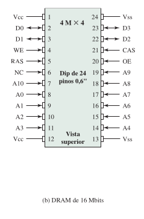

# Resolução da perguntas de revisão de cada capítulo

## Capítulo 5: Memória interna

**1.** Quais são as principais propriedades da memória semicondutora?

- Apresentam dois estados estáveis (ou semiestáveis), que podem ser usados para representar o binário 1 e 0;
- São capazes de serem gravadas (pelo menos uma vez), para definir o estado.
- São capazes de serem lidas, para verificar o estado.

**2.** Quais são as duas interpretações do termo memória de acesso aleatório?

- É uma memória cujo conteúdo pode ser acessado em qualquer ordem, diretamente.

- É distinto da memória ROM a qual, apesar de possibilitar o acesso aleatório como a RAM, não possui ou tem limitada sua capacidade de escrita na memória.

**3.** Qual a diferença entre DRAM e SRAM em termos de aplicação?

a SRAM é usada para a **memória cache** (no chip e fora dele), e a DRAM é usada para a **memória principal**.

**4.** Qual é a diferença entre DRAM e SRAM em termos das características como velocidade, tamanho e custo?

- Uma célula de memória dinâmica é mais simples e menor que uma célula de memória estática. Assim, a DRAM é mais densa (células menores = mais células por unidade de área) e **mais barata** que uma SRAM correspondente.

- DRAM requer o suporte de um circuito de *refresh* (atualização). Não obstante, memórias maiores, o custo fixo do circuito de refresh é mais do que compensado pelo menor custo variável das células de DRAM. Assim, as DRAMs tendem a ser favorecidas para as exigências de **memórias grandes**.

- Outro ponto é que as SRAMs geralmente são um pouco **mais rápidas** que as DRAMs.

**5.** Explique por que um tipo de RAM é considerado como analógico e o outro digital.

Um sinal analógico trata-se de um sinal que pode assumir um valor dentre uma continuidade de valores, um sinal digital assume apenas valores discretos, frequentemente binários. A SRAM, por implementar *flip-flops*, assume apenas os valores 0 ou 1 e portanto é digital. A DRAM implementa capacitores cujo nível de carga degrada progressivamente em função do tempo, e exige o *refresh* para que esta se mantenha acima ou abaixo de determinado patamar. Em um processo de conversão, valores acima deste patamar são interpretados como 1 e abaixo como 0. Não obstante, aquilo que está sendo efetivamente armazenado pelos capacitores é um sinal *analógico*.

**6.** Quais são algumas aplicações para a ROM?

Uma **memória somente de leitura** (**ROM** ‒ do inglês, *Read-Only Memory*) trata-se de um padrão permanente de dados, um armazenamento não-volátil o qual não pode ser alterado. Este é um tipo de memória bastante importante para a microprogramação, dentre outras funções tais quais:

- Dub-rotinas de biblioteca para funções frequentemente utilizadas.

- Programas do sistema.

- Tabelas de função.

**7.** Quais são as diferenças entre EPROM, EEPROM e memória flash?

Tomemos a EPROM (mémoria somente de leitura programável e apagável) por base da nossa comparação. Estra trata-se de uma memória gravável eletronicamente, cujo conteúdo anterior pode ser apagado pela exposição do chip de memória à radiação ultravioleta intensa. Este processo de apagamento pode levar até 20 minutos para ser terminado e é necessário que todo o conteúdo anterior seja apagado antes que um novo conteúdo seja gravado. Não obstante, a EPROM pode ser regravada várias vezes e mantém seus dados indefinidamente.

Por outro lado o EEPROM (memória somente de leitura programável e apagável eletricamente) pode ser gravada a qualquer momento sem que antes seja necessário apagar o conteúdo anterior; somente o byte, ou bytes, endereçados são atualizados. Seu processo de gravação é mais rápido que aquele da EPROM mas, por outro lado,  este possui menor capacidade de armazenamento.

Finalmente a memória flash é intermediária entre a EPROM e a EEPROM tanto no custo quanto na funcionalidade. Assim como a EEPROM, a memória flash é apagada com tecnologia elétrica. Uma memória flash inteira pode ser apagada em um ou alguns segundos, o que é muito mais rápido que a EPROM. Além disso, é possível apagar apenas blocos de memória, em vez de um chip inteiro. A memória flash recebeu esse nome porque o microchip é organizado de modo que uma seção das células de memória é apagada em uma única ação, ou “em um flash”. No entanto, a memória flash não pode ser apagada no nível de byte. Assim como a EPROM, a memória flash usa apenas um transistor por bit e, portanto, consegue ter a alta densidade da EPROM (em comparação com a EEPROM).

**8.** Explique a função de cada pino na figura abaixo.

Vide legenda logo acima donde esta imagem foi retirada.

**9.** O que é bit de paridade?

Bits os quais indicam a ocorrência, ou não, de um número par de bits de mesmo tipo em um conjunto de dados binários.

**10.** Como a síndroma para o código de Hamming é interpretada?

O algarismo aquele diferente de 0 indica a ocorrência de uma divergência entre o conteúdo armazenado e o conteúdo esperado tendo em vista os valores dos bits de paridade. Havendo um único bit 1 na palavra síndroma, o bit correspondente no conteúdo original é marcado para correção.

## Capítulo 6

**1.** Quais são as vantagens de usar um substrato de vidro para um disco magnético?

Em comparação às alternativas, como o alumínio, o vidro apresenta:

- Melhoria na uniformidade da superfície do filme magnético, aumentando a confiabilidade do disco.

- Capacidade de aceitar alturas de voo mais baixas. Isto é, a cabeça (de leitura ou gravação) pode ficar mais próxima da superfície do disco em seu processo de leitura ou gravação.

- Maior rigidez e portanto capacidade para suportar choques e danos.

**2.** Como os dados são gravados em um disco magnético?

Os dados são gravados e, mais tarde, recuperados do disco por meio de uma bobina condutora, denominada de **cabeça**. Durante uma operação de leitura ou gravação, a cabeça fica estacionária, enquanto o disco gira por baixo dela.

Para a escrita de dados, uma corrente elétrica na cabeça induz um campo magnético no espaço, que, por sua vez, magnetiza uma pequena área do disco. Reverter a direção da corrente reverte a direção da magnetização.

**3.** Como os dados são lidos de um disco magnético?

O mecanismo de leitura tradicional explora o fato de que um campo magnético movendo-se em relação a uma bobina produz uma corrente elétrica na bobina. Quando a superfície do disco passa sob a cabeça, ela gera uma corrente com a mesma polaridade daquela já gravada.

**4.** Explique a diferença entre um sistema CAV simples e um sistema com gravação em múltiplas zonas.

Um sistema CAV possui trilhas cuja densidade, em bits por polegada linear, é menor quanto mais distantes estas estão localizadas do centro do disco, assim a informação do disco pode ser varrida pela cabeça em qualquer ponto com uma mesma taxa, girando o disco a uma velocidade fixa, denominada **velocidade angular constante** (**CAV** ‒ do inglês *Constant Angular Velocity*). Por outro lado, a capacidade de armazenamento de disco em um sistema com CAV fica limitada pela densidade de gravação máxima que pode ser obtida na trilha mais interna.

Sistemas de **gravação com múltiplas zonas** (**MZR** ‒ do inglês *Multiple Zone Recording*) melhoram o aproveitamento da superfície do disco para armazenamento. Esta superfície é dividida em uma série de zonas concêntricas, em que cada zona contém várias trilhas contíguas de mesmo número de bits. As zonas mais distantes do centro contêm mais bits (mais setores) do que as zonas próximas do centro, de modo que a densidade linear de bits seja aproximadamente a mesma em todas as trilhas do disco. Por outro lado, à medida que a cabeça do disco se move de uma zona para outra, o tamanho (ao longo da trilha) dos bits individuais muda, causando uma alteração no tempo para leituras e gravações.

**5.** Defina os termos *trilha*, *cilindro* e *setor*.

No contexto dos disco rígidos, refere-se por 

- *setor* a menor porção endereçável da memória. Na superfície do disco, esta é correspondente a um setor de uma circunferência qualquer concêntrica ao centro do disco.

- *trilha* um conjunto de setores que forma uma circunferência completa.

- *cilindro* um conjunto de trilhas de mesmo perímetro, nas superfícies de vários discos em parelhados.

**6.** Qual é o tamanho típico de um setor de disco?

É um padrão quase universal este possuir 512 bytes de armazenamento, mas mais bytes podem ser acrescentados para propósitos de endereçamento e controle.

**7.** Defina os termos *tempo de busca*, *atraso rotacional*, *tempo de acesso* e *tempo de transferência*.

**Tempo de busca (*seek time*):** O tempo gasto para posicionar a cabeça sobre uma dada trilha em um sistema de cabeça móvel.

**Atraso rotacional:** Trata-se do tempo gasto para se rotacionar o disco até que o início de um setor buscado encontre-se sob a cabeça, q esta última já está sobre a trilha que contém um setor buscado.

**Tempo de acesso:** A soma do tempo de busca e atraso rotacional.

**Tempo de transferência:** O tempo para leitura ou gravação de um setor quando este já encontra-se alinhado com a cabeça.

**8.** Que características comuns são compartilhadas por todos os níveis de RAID?

Os diferentes RAIDs consistem todos de maneiras distintas para se obter um subsistema de armazenamento composto por vários discos individuais, com a finalidade de ganhar segurança -- por meio da redundância de dados — e desempenho.

**9.** Defina resumidamente os sete níveis de RAID.

[What is RAID 0, 1, 2, 3, 4, 5, 6 and 10 (1+0)? - Invidious](https://yewtu.be/watch?v=wTcxRObq738)

## Capítulo 7

**1.** Liste três classificações gerais de dispositivos externos ou periféricos.

- **Interface humano-máquina:** adequado a comunicação dos usuários com o computador.

- **Interface máquina-máquina:** adequado a comunicação entre equipamentos.

- **Comunicação remota:** Adequado especificamente a comunicação entre dispositivos remotos.

**2.** O que é um *International Reference Alphabet*?

Um conjunto padronizado de códigos binários de 8 bits associados a caracteres, os quais podem ser imprimíveis ou de controle (como a quebra de linha, a tabulação). Desta forma, fica possível um usuário pode interagir com o computador por intermédio de um teclado.

**3.** Quais são as principais funções de um módulo de E/S?

- Controle e temporização.
  
  - Coordena o fluxo de tráfego entre os recursos internos e dispositivos externos.

- Comunicação com o processador.
  
  - Envolve os seguintes procedimentos:
    
    - **Decodificação** do comando passado pelo processador.
    
    - Transmissão e recebimento de dados.
    
    - Informação do estado do dispositivo de E/S. Os mais comuns são *BUSY* e *READY*. Também pode haver sinais para informar diversas condições de erro.
    
    - Reconhecimento de endereço (assim como cada palavra de memória tem um endereço, cada dispositivo de E/S também tem).

- Comunicação com o dispositivo (de E/S).
  
  - Contraparte dos procedimentos anteriormente descritos para o processador.

- Buffering de dados.
  
  - Enquanto a taxa de transferência para entrada e saída na memória principal ou no processador é muito alta, as taxas da maioria dos dispositivos periféricos compreendem uma grande faixa. Assim, os dados são mantidos em um buffer no módulo de E/S e depois enviados ao dispositivo periférico em sua própria taxa de dados.

- Detecção de erro (e comunicação destes ao processador).

**4.** Liste e defina brevemente três técnicas para realizar E/S.

1. **E/S programada:** O processador executa um programa que dá ao módulo de E/S controle direto da operação de E/S, incluindo verificação do estado de dispositivo, envio de um comando de leitura ou escrita e transferência dos dados. Quando o processador emite um comando ao módulo de E/S, ele deve esperar até que a operação de E/S termine. **Desvantagens:** Se o processador for mais rápido que o módulo de E/S, isso desperdiça o tempo do processador.

2. **E/S (programada) controlada por interrupção:** o processador emite um comando de E/S, continua a executar outras instruções e é interrompido pelo módulo de E/S quando o último tiver completado seu trabalho. O processador então fica responsável por obter dados da memória principal para saída e por armazenar dados na memória principal da entrada.

3. **Acesso direto à memória (DMA):** o módulo E/S e a memória principal trocam dados diretamente, sem envolvimento do processador.

**5.** Qual é a diferença entre E/S mapeada na memória e E/S independente?

Um processador que implementa **E/S mapeada na memória** divide seu espaço de endereçamento em porções reservadas para a memória principal e dispositivos de E/S. Desta forma o processador pode acessar e passar instruções diretamente aos dispositivos sendo acessados, sem a necessidade de mediação por um módulo de E/S.

Por outro lado, um processador que implementa E/S independente possui regiões da memória separadas para a memória principal e dispositivos, interagindo com estes últimos utilizando-se de comandos específicos e generalizados. Tais como `outb`, `outw` ou `outl` para realizar a leitura de 1, 2 e 4 bytes, a serem enviados pelo módulo de E/S, respectivamente.

**6.** Quando ocorre uma interrupção de dispositivo, como o processador determina qual dispositivo enviou a interrupção?

Uma alternativa é a **verificação por software**. Quando o processador detecta uma interrupção, ele desvia para uma rotina de tratamento de interrupção cuja tarefa é verificar cada módulo de E/S para determinar qual módulo causou a interrupção.

Uma técnica mais eficiente é usar uma configuração **daisy chain** (ou "interrupção vetorada"), que oferece uma verificação por hardware. Quando o processador reconhece uma interrupção, ele envia uma confirmação de interrupção. Esse sinal se propaga por uma série de módulos de E/S até ser recebido pelo módulo requisitante. O módulo requisitante normalmente responde colocando uma palavra das linhas de dados. Essa palavra é conhecida como vetor e é o endereço do módulo de E/S ou algum outro identificador exclusivo. De qualquer forma, o processador usa o vetor como um ponteiro para a rotina apropriada de serviço de dispositivo.

**7.** Quando um módulo de DMA toma o controle de um barramento, e enquanto ele retém o controle do barramento, o que o processador faz?

Este executa quaisquer outros processos que estejam disponíveis para serem executados imediatamente.

## Capítulo 8

**1.** O que é sistema operacional?

Um programa que controla a execução dos programas aplicativos e atua como uma interface entre o usuário e o hardware do computador, de maneira a fazer com que esta interação seja a mais conveniente e eficiente possível para o uso.

**2.** Liste e defina de forma resumida os principais serviços fornecidos por um sistema operacional.

- **Criação de programas:** Por meio de um conjunto de utilitários que são acessíveis por meio do SO (não necessariamente são intrínsecos a este), os quais por vezes são instalados por padrão.

- **Execução de programas:** o SO gerencia a memória principal, o acesso a dispositivos de E/S, o acesso controlado aos arquivos, dentre outros requisitos para que um número de programas sejam executados pelo usuário.

- **Acesso ao sistema:** No caso de um sistema compartilhado ou público, o SO controla o acesso ao sistema como um todo e a seus recursos específicos, para cada um dos usuários. Isso, de tal forma a oferecer proteção de recursos e dados de usuários não autorizados e resolver disputas por recursos.

- **Detecção e resposta a erros:** uma grande variedade de erros pode ocorrer enquanto um sistema computacional está em funcionamento. Alguns desses erros podem ser de hardwares internos e externos, como um erro de memória ou uma falha ou defeito de dispositivo; e outros podem ser de software, como estouro (*overflow*) aritmético, tentativa de acessar um local proibido da memória e incapacidade do SO em conceder a solicitação de uma aplicação. Em cada caso, o SO deve tomar uma medida que encerre a condição de erro com o mínimo de impacto sobre as aplicações em execução. A resposta pode variar desde encerrar o programa que causou o erro, até tentar a operação novamente ou apenas informar o erro à aplicação.

- **Contabilização:** Monitoração do desempenho geral do sistema operacional. Em qualquer sistema, essa informação é útil na antecipação da necessidade de melhorias futuras e no ajuste do sistema para melhorar o desempenho.

**3.** Liste e defina de forma resumida os principais tipos de escalonamento do sistema operacional.

- **Escalonamento de longo prazo:** Um escalonador de longo prazo determina quais programas serão submetidos ao sistema para processamento. Dessa forma, ele controla o grau de multiprogramação (número de processos na memória). Uma vez submetido, um job ou programa do usuário torna-se um processo e é acrescentado à fila para o escalonador de curto prazo. Mas em alguns sistemas, um processo recém-criado inicia-se em uma condição em que não é carregado na memória principal, mas carregado no disco, neste caso, ele é inserido em uma fila para o escalonador de médio prazo. 

- **Escalonamento de médio prazo:** O escalonamento de médio prazo faz parte da função de troca de processo (*swapping*). Em geral, a decisão de entrada no *swapping* é baseada na necessidade de gerenciar o *grau* de multiprogramação. De tal maneira, a decisão de processo de memória considerará os requisitos de memória dos processos que são removidos para o disco.

- **Escalonamento de curto prazo:** O escalonador de curto prazo, também conhecido como *despachante*, é executado com frequência e toma a decisão de granulação fina de qual tarefa executar em seguida a depender do **estado** dos processos. No mínimo, existem cinco estados definidos para um processo:
  
  - **Novo:** o programa é admitido, mas não está pronto para ser executado. O SO iniciará o processo, movendo-o ­para o estado *pronto*.
  
  - **Pronto:** o processo está pronto para ser executado e está aguardando o acesso ao processador.
  
  - **Em execução:** o processo está sendo executado pelo processador.
  
  - **Em espera:** o processo está com sua execução suspensa, aguardando por algum recurso do sistema, como a E/S.
  
  - **Terminado:** o processo terminou e será destruído pelo SO.

**4.** Qual a diferença entre um processo e um programa?

Um programa é um conjunto de instruções, armazenadas na memória secundária, aptas a serem executadas pelo processador. O processo trata-se de uma instância do programa, carregada na memória primária, em execução por parte do processador.

**5.** Qual é o propósito da troca de processos na memória (*swapping*)?

Desocupar a memória principal de processos ociosos, enviando-os à memória virtual e retirando desta última processos os quais podem ser executados imediatamente. Desta forma, melhorando o aproveitamento do processador permitindo este executar um maior número de processos simultaneamente.

**6.** Se um processo pode ser atribuído dinamicamente a diferentes locais na memória principal, qual é sua implicação para o mecanismo de endereçamento?

Faz-se necessário que haja a distinção entre aquilo que é um **endereço lógico** de um **endereço físico**. O endereço lógico é um endereço de memória relativo a posição nesta em que o processo foi alocado, enquanto o **endereço físico** é a posição absoluta ocupada pelo processo na memória. As instruções de um processo realizam chamadas ao processador fazendo uso do endereço lógico, enquanto o processador converte essas chamadas pelas equivalentes em endereço físico.

**7.** É necessário que todas as páginas de um processo estejam na memória enquanto o processo está sendo executado?

Não necessariamente, em um modelo de **paginação por demanda** é possível que o processo seja parcialmente (ou inteiramente, quando ocioso) armazenado na memória virtual.

**8.** As páginas de um processo na memória principal devem ser contíguas?

Não, o SO mantém uma **tabela de páginas** para cada processo, a qual mostra o local de cada página no processo. Dentro do programa, cada endereço lógico consiste em um número de página e um endereço relativo dentro da página. Desta forma, endereços lógicos contíguos podem ser mapeados à endereços físicos descontínuos.

**9.** É necessário que as páginas de um processo na memória principal estejam em ordem sequencial?

Também não.