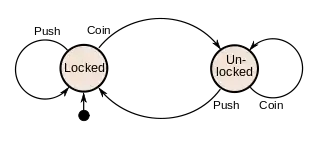
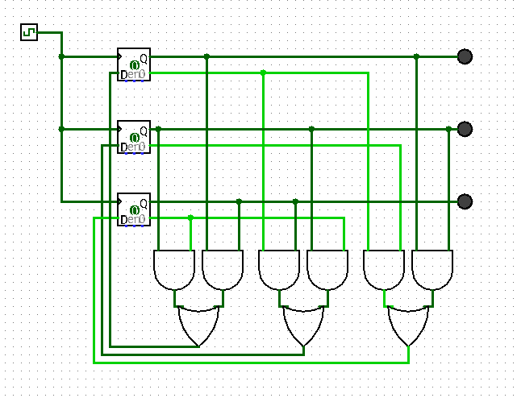
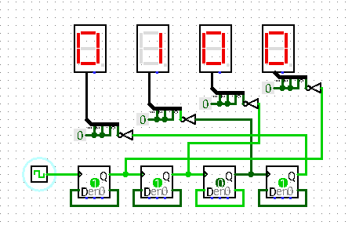

# Simulado da Prova 1

## Questão 1

**Explique a construção de um computador.**

Um computador trata-se de uma máquina eletrônica e digital de propósito geral, que pode ser programada para realizar uma sequência de operações lógicas ou aritméticas de forma autônoma.

Para isso, estes dispõem de circuitos sobre placas semicondutoras capazes de emitir e controlar o fluxo de sinais elétricos, de tal forma que a presença deste equivale ao número 1 e a ausência deste o número 0 em um sistema organizado segundo uma lógica binária.

Portas lógicas são mecanismos pelos quais este controle ocorre. Funcionando como relês (interruptores do circuito), transistores são dispostos no circuito de acordo com a operação lógica pretendida. Transistores são dispositivos capazes de interromper uma corrente em seu estado inicial ou amplificá-la ao receber um sinal elétrico, ou vice-versa, de maneira que a distinção entre 0s e 1s seja inequívoca. Um circuito que é desligado quando um sinal elétrico é enviado ao transistor é denominado uma "porta NOT" ("NOT" de "negação", em inglês), enquanto um circuito que é desligado quando um sinal é enviado a qualquer um de um par de transistores é chamado "porta NOR" ("NOR" de "nem um ou outro"). Pela conjunção destes circuitos é possível gerar outras portas lógicas como AND ou OR, e mesmo compor tais operações lógicas de  forma a realizar operações aritméticas, como a soma de valores binários. Também torna-se possível à partir destes a criação de circuitos mais complexos como:

- multiplexadores, que selecionam um dos seus sinais de entrada para emiti-lo na saída;

- decodificadores, que emite um único sinal de saída a depender da combinação de sinais de entrada;

- flip-flops, que são capazes de reter sinais e, portanto, valores;

- contadores, que pela conjunção de flip-flops permitem a realização de uma contagem em dígitos binários;

- registradores, que armazenam dados específicos para acesso rápido por parte do processador para executar instruções.

Com estes componentes, temos aquilo que é necessário para a construção de um computador segundo o *modelo von Neumann*. Agrupando-os em componentes maiores, temos:

- A Unidade de Processamento Central (CPU), composta por:
  
  - Unidade lógico-aritmética: contendo os circuitos capazes de realizar operações aritméticas e os registradores necessários para armazenar os operandos e resultado da operação (acumuladores);
  
  - Unidade de Controle: Que incorpora o contador de programa ‒ o qual indica uma posição da memória a se ler uma instrução e, se não instruído doutra forma, incrementa após a execução desta para a realização de instruções em sequência ‒, e os registradores de instrução, para ler as instruções a serem decodificadas e realizadas.

- Uma memória primária, para o armazenamento dos dados e instruções pertinentes ao processamento de dados;

- Mecanismos de entrada e saída ligando estes dois componentes, a CPU à dispositivos periféricos como a memória secundária, telas, teclado, etc.

Podemos ilustrar o funcionamento de um computador fazendo uso do modelo de computação do *autômato finito*. Isto é, o computador enquanto uma máquina que existe em um número finito de estados em um dado momento, alterando-se (transitando) em função de estímulos externos (inputs).

Considere o computador enquanto um microcontrolador de uma catraca. Esta possui um estado inicial: trancada, informação esta armazenada em sua memória. Ao receber o estímulo do depósito de uma moeda, o processador interpreta este input em conjunção com seu atual estado enquanto uma instrução para destrancá-la, e assim o faz: a catraca agora encontra-se destrancada e este estado é armazenado na memória. Neste estado, girar a catraca envia um estímulo que o processador interpreta enquanto uma instrução para novamente trancá-la, mas colocar uma moeda não é mais interpretado enquanto uma instrução que a faça transitar a outro estado. Enquanto isso, quando trancada empurrar as hastes da catraca deixa de ser uma instrução de transição de estado. Tal qual ilustra o seguinte diagrama:

> Diagrama de estados da catraca

Por fim, dado o exemplo, vê-se porque o computador é considerado uma máquina de propósito geral: seu o processador é capaz de reconfigurar-se autonomamente dada uma instrução para isso, de tal forma que em dados momentos encontra-se configurado para a realização de uma tarefa específica, mas no momento seguinte pode não estar.

## Questão 2

Tal qual elucidado na questão anterior, o computador trata-se de uma máquina cuja operacionalização se dá através de instruções (opcodes, por exemplo, para a ULA realizar uma soma, ou a Unidade de Controle realizar um salto na sequência de acesso à memória) e endereços de memória (seja da memória primária ou dos registradores) descritos em linguagem binária. Assim sendo, a leitura e escrita de programas feita nesta linguagem é, para seres humanos, demasiadamente dificultosa se comparadas a descrições dos mesmos noutras linguagens, como as linguagens de programação.

Linguagens de programação são linguagens formais mais próximas da linguagem natural e que são adequadas à terem seu conteúdo traduzido em linguagem binária por um processo de interpretação, compilação ou no caso de linguagens de baixo nível (de abstração), montagem.

A linguagem de montagem (*assembly*) é a linguagem de programação dita de baixo nível. Nesta, existe uma correspondência de um para um entre os comandos descritos e as instruções executadas pelo computador e também uma correspondência ao conjunto de instruções específico à arquitetura do processador daquele computador. Assim o sendo, estas seguem de maneira próxima o formato das "palavras" que descrevem instruções ao computador. Por exemplo, para um processador de 32 bits `MOV AL, 61h` corresponde à `10110000 01100001` onde `MOV` é o mnemônico para o códio de operação `10110`, `AL` é o identificador do registrador de endereço `000` e `61h` descreve o valor binário `01100001` em valor hexadecimal.

Por outro lado, linguagens de alto nível como o C não possuem este mesmo nível de correspondência com a linguagem de máquina e precisam ser primeiramente convertidos em linguagem de montagem para finalmente criar programas executáveis (processo de compilação). Embora isso implique em uma performance inferior na geração do arquivo executável e menor controle no acesso a recursos específicos do hardware por parte do programador, o maior nível de abstração permite a formulação de código-fonte mais simples de ser entendido, escrito, mais compacto e portátil entre computadores de diferentes arquiteturas.

### Questão 3

**a. Faça a tabela de transição do código de Gray**

Seja $Q_1, Q_2, Q_3$ o estado atual de cada bit do mais ao menos significativo e $D_1, D_2, D_3$ o estado seguinte destes mesmos na contagem. Tem-se:

| $Q_1$ | $Q_2$ | $Q_3$ | $D_1$ | $D_2$ | $D_3$ |
|:-----:|:-----:|:-----:|:-----:|:-----:|:-----:|
| 0     | 0     | 0     | 0     | 0     | 1     |
| 0     | 0     | 1     | 0     | 1     | 1     |
| 0     | 1     | 1     | 0     | 1     | 0     |
| 0     | 1     | 0     | 1     | 1     | 0     |
| 1     | 1     | 0     | 1     | 1     | 1     |
| 1     | 1     | 1     | 1     | 0     | 1     |
| 1     | 0     | 1     | 1     | 0     | 0     |
| 1     | 0     | 0     | 0     | 0     | 0     |

**b. Faça as expressões lógicas para cada bit**

O seguintes mapas de Karnough expressam a relação lógica entre os bits:

**Para D~1~:**

| Q~1~\Q~2~Q~3~ | 00  | **01** | **11** | **10** |
| -------------:|:---:|:------:|:------:|:------:|
| **0**         | 0   | 0      | 0      | 1      |
| **1**         | 0   | 1      | 1      | 1      |

Logo $D_1 = 1$ se $Q_2 \overline Q_3 + Q_1Q_3 = 1$

**Para D~2~:**

| Q~1~\Q~2~Q~3~ | 00  | **01** | **11** | **10** |
| -------------:|:---:|:------:|:------:|:------:|
| **0**         | 0   | 1      | 1      | 1      |
| **1**         | 0   | 0      | 0      | 1      |

Logo $D_2 = 1$ se $\overline Q_1Q_3 + Q_2\overline Q_3 = 1$

**Para D~3~:**

| Q~1~\Q~2~Q~3~ | 00  | **01** | **11** | **10** |
| -------------:|:---:|:------:|:------:|:------:|
| **0**         | 1   | 1      | 0      | 0      |
| **1**         | 0   | 0      | 1      | 1      |

Logo $D_3 = 1$ se $\overline Q_1\overline Q_2 + Q_1Q_2 = 1$

**c. Monte o circuito do contador do código Gray**

## Questão 4

Envolve ponto flutuante, não vai cair segundo comentário na última aula.

## Questão 5

**a. Faça a tabela de transição**

| $Q_1$ | $Q_2$ | $Q_3$ | $Q_4$ | $D_1$ | $D_2$ | $D_3$ | $D_4$ |
|:-----:|:-----:|:-----:|:-----:|:-----:|:-----:|:-----:|:-----:|
| 0     | 0     | 0     | 0     | 0     | 0     | 0     | 1     |
| 0     | 0     | 0     | 1     | 0     | 0     | 1     | 0     |
| 0     | 0     | 1     | 0     | 0     | 0     | 1     | 1     |
| 0     | 0     | 1     | 0     | 0     | 0     | 1     | 1     |
| 0     | 1     | 0     | 0     | 0     | 1     | 0     | 1     |
| 0     | 1     | 0     | 1     | 0     | 1     | 1     | 0     |
| 0     | 1     | 1     | 0     | 0     | 1     | 1     | 1     |
| 0     | 1     | 1     | 1     | 1     | 0     | 0     | 0     |
| 1     | 0     | 0     | 0     | 1     | 0     | 0     | 1     |
| 1     | 0     | 0     | 1     | 1     | 0     | 1     | 0     |
| 1     | 0     | 1     | 0     | 1     | 0     | 1     | 1     |
| 1     | 0     | 1     | 1     | 1     | 1     | 0     | 0     |
| 1     | 1     | 0     | 0     | 1     | 1     | 0     | 1     |
| 1     | 1     | 0     | 1     | 1     | 1     | 1     | 0     |
| 1     | 1     | 1     | 0     | 1     | 1     | 1     | 1     |
| 1     | 1     | 1     | 1     | 0     | 0     | 0     | 0     |

**b. Faça as expressões lógicas para cada bit**

**D~1~**

| Q~1~Q~2~\Q~3~Q~4~ | 00  | 01  | 11  | 00  |
| -----------------:|:---:|:---:|:---:|:---:|
| **00**            | 0   | 0   | 0   | 0   |
| **01**            | 0   | 0   | 1   | 0   |
| **11**            | 1   | 1   | 0   | 1   |
| **10**            | 1   | 1   | 1   | 1   |

Logo, $D_1 = \overline Q_1Q_2Q_3Q_4 + Q_1\overline Q_2 + Q_1\overline Q_3 + Q_1\overline Q_4$

**D~2~**

| Q~1~Q~2~\Q~3~Q~4~ | 00  | 01  | 11  | 00  |
| -----------------:|:---:|:---:|:---:|:---:|
| **00**            | 0   | 0   | 1   | 0   |
| **01**            | 1   | 1   | 0   | 1   |
| **11**            | 1   | 1   | 0   | 1   |
| **10**            | 0   | 0   | 1   | 0   |

Logo, $D_2 = \overline Q_2Q_3Q_4 + Q_2 \overline Q_3 + Q_2 \overline Q_4$

**D~3~**

| Q~1~Q~2~\Q~3~Q~4~ | 00  | 01  | 11  | 00  |
| -----------------:|:---:|:---:|:---:|:---:|
| **00**            | 0   | 1   | 0   | 1   |
| **01**            | 0   | 1   | 0   | 1   |
| **11**            | 0   | 1   | 0   | 1   |
| **10**            | 0   | 1   | 0   | 1   |

Logo, $D_3 = \overline Q_3Q_4 + Q_3 \overline Q_4 = Q_3 \oplus Q_4 $

**D~4~**

| Q~1~Q~2~\Q~3~Q~4~ | 00  | 01  | 11  | 00  |
| -----------------:|:---:|:---:|:---:|:---:|
| **00**            | 1   | 0   | 0   | 1   |
| **01**            | 1   | 0   | 0   | 1   |
| **11**            | 1   | 0   | 0   | 1   |
| **10**            | 1   | 0   | 0   | 1   |

Logo, $D_4 = \overline Q_4$

**c. Monte o circuito do contador binário**

