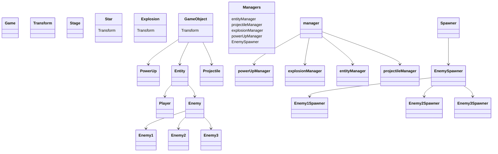
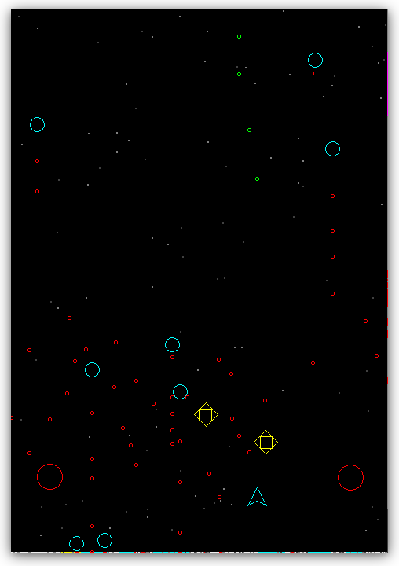
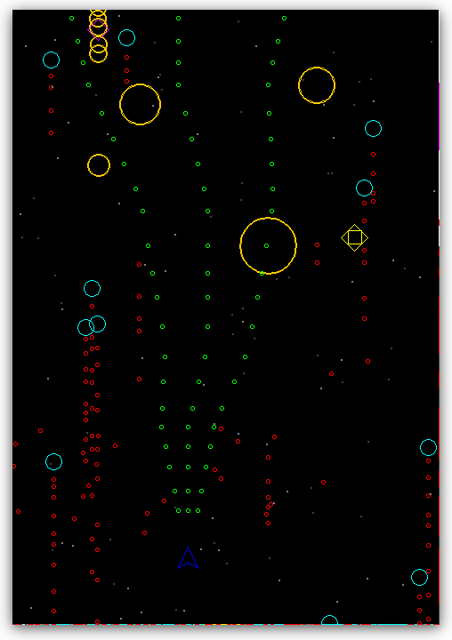

# Aplicação de princípios de POO a um código procedural

> **Autores:**
> 
> César Billalta Yamasato, nUSP: 12542992
> 
> Guilherme de Abreu Barreto, nUSP: 12543033
> 
> Roberta Vitoria Borges, nUSP 11344811
> 
> Marcus Imazava Gianini, nUSP: 12717669

## Resumo

Neste relatório descrevemos nosso processo para a *refatoração* do código procedural de um jogo de tal forma que este seja compatível com princípios de programação orientada a objetos (POO). Iniciamos por tecer uma crítica ao código original, para então justificar a estrutura de classes em termos de heranças e composições, dentre outras funcionalidades da linguagem Java das quais fizemos uso. Por fim, relatamos novas funcionalidades que acrescentamos ao jogo fazendo uso destas mesmas estruturas.

## Críticas ao código original do jogo

É notável, no código original, que este possui uma maior redundância de porções de código. Por exemplo,  as linhas `307` à `322` e `326` à `341` descrevem o mesmo procedimento de 15 linhas, aplicado ao conjunto de projéteis atirados pelo jogador e os inimigos, respectivamente. Tais porções de código podem ser resumidas em porções únicas que não se repetem, fazendo uso da programação orientada a objetos ou mesmo a programação funcional. Não obstante, mesmo as porções aquelas com ligeiras diferenças (digamos, a forma com que os inimigos das variedade 1 e 2 aparecem na tela em diferentes intervalos e localidades) podem se beneficiar do uso de uma mesma interface que gerencia a ocorrência destes eventos em intervalos e localidades regulares conforme parâmetros fornecidos. De maneira a satisfazer estas condições, objetivamos a reescrita do código.

## Estrutura de classes

À seguir apresentamos um diagrama que descreve a relação de extensão ou implementação presente entre as classes e interfaces do jogo. Depois, sumarizamos a funcionalidade das principais classes ou interfaces dentre estas.

### Hierarquia de classes

### Estrutura de classes

**Classe Game:** Contém a função `main` mais as variáveis `currentTime`, `delta` e a função `busyWait`. É responsável por chamar as demais classes em última instância e realiza o controle do tempo de execução do jogo, encerrando-o se for assim requisitado.

**Classe Transform:** Contém as variáveis que realizam o controle da posição dos objetos imprimíveis na tela, que incluem as estrelas e os `GameObjects`.

**Classe Stage:** Inicializa `GameLib.initGraphics()` e mantém dois ArrayLists de estrelas que descrevem os dois níveis de profundidade das estrelas no plano de fundo.

**Classe GameObject:** Implementa a classe `Transform` por composição, e descreve um método de detecção de colisões, necessário a todos os elementos imprimíveis interativos.

**Classe Entity:** Implementa as funções comuns ao jogador e seus inimigos, como a habilidade de atirar, receber dano e explodir.

**Interface Spawner:** Descreve a função `tryToSpawn`, relativa a todos os GameObjects e gerenciada pelos seus respectivos Spawners.

**Classe Manager:** Classe abstrata que implementa todas as funcionalidades de gerenciamento de coleções, das quais fazemos uso para geração de múltiplos objetos na tela.

**Classe Managers:** Classe que declara e unifica o controle sobre todos os managers.

## Novas funcionalidades

**Inimigo 3:** Trata-se de um inimigo capaz de atirar dois projéteis de grande envergadura às duas diagonais simultaneamente. Depois, este passa a perseguir o jogador. Ao destruí-lo, o jogador poder recolher um *PowerUp* que este deixa para trás.

**PowerUp**: O jogador, ao obter este item, passa a ser capaz de atirar em três direções ao mesmo tempo: diretamente à frente dele e nas duas diagonais frontais.

## Uso de coleções java

No código original apresentado, os *arrays* eram utilizados como uma forma de armazenar os atributos dos elementos do jogo, tais como posição e velocidade, cada qual armazenando apenas um tipo de atributo, de tal maneira que a única relação mantida pelos atributos de um mesmo elemento era o fato de estarem na mesma posição em *arrays* diferentes. As coleções java foram utilizadas como uma alternativa aos vetores para acompanhar os objetos do jogo.

Utilizando as coleções, foi possível criar listas dinâmicas de objetos dos tipos desejados, eliminando, em boa parte, a necessidade de manutenção dos elementos do jogo. Um dos exemplos mais notáveis disso é o fato de não ser mais necessário uma variável que denota estado (ou *state*, no código original), uma vez que, para eliminar um inimigo, basta removê-lo da lista e adicionar à lista de explosões uma nova, que será desenhada e então removida.

Além do uso das coleções para apenas criar ou eliminar os diversos elementos no jogo, elas também foram utilizadas, na classe `entityManager` para manter *spawners*, de maneira a facilitar a adição de novos tipos de inimigos posteriormente. Para tal, bastou criar uma nova classe de inimigo com as especificidades dele (como forma de movimento ou tiro) e então criar uma classe `spawner` para esse inimigo junto com uma nova instância static na classe `Managers` e então a classe `spawner` se encarregará de criar os inimigos na tela.

## Conclusão

Tal qual demonstrado, a Programação Orientada à Objetos permite maior modularização e menor redundância na descrição de instruções quando comparada a programação procedural. Graças ao uso de classes e interfaces,  adição de novas funcionalidades foram acrescentadas derivando-se de definições descritas previamente. Embora aqui o uso destes recursos tenha sido apenas superficialmente explorado em um projeto de pequeno porte, vê-se que é possível que esta capacidade evite maiores quantidades de retrabalho em projetos mais elaborados.