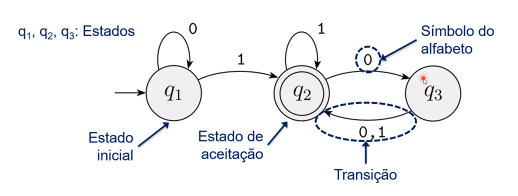

# Notas da aula 1

## Definições do Capítulo 0

### Alfabeto

Denominação dada a qualquer conjunto não-vazio, onde os membros deste são denominados seus **símbolos**. Geralmente utiliza-se letras gregas maiúsculas para se designar alfabetos ($\Sigma, \Phi,$ etc.)

#### Cadeia (sobre um alfabeto)

> Também denotado por "palavra" ou "string".

Qualquer sequência de símbolos de um determinado alfabeto. Por exemplo, se $\Sigma = \{0,1\}$, então 01001 é uma cadeia sobre $\Sigma$.

- O uso do caractere "|" é feito para indicar o comprimento de uma cadeia qualquer. Por exemplo, "$|w|$" indica o comprimento da cadeia $w$.

- A cadeia de comprimento zero é chamada **cadeia vazia** e é denotada usualmente pelos caracteres $\varepsilon$ ou $\lambda$.

- O uso de numeradores ($w_1, w_2, \dots, w_n$) pode ser empregado para designar dados caracteres na sequência da cadeia.

- Dado um alfabeto $\Sigma$ denota-se por $\Sigma^*$ o conjunto de todas as cadeias possíveis de serem formadas sobre o alfabeto $\Sigma$, *incluindo a cadeia vazia*.

##### Reverso

A sequência $w^R$ que contém os caracteres da cadeia $w$ em ordem reversa. Por exemplo, se $w = 10110$, então $w^R = 01101$.

##### Subcadeia

Denominação dada a qualquer cadeia $z$ contida noutra cadeia $w$, tal que $z \subseteq w$.

##### Concatenação

Seja a palavra $x$ de comprimento $m$ e a palavra $y$ de comprimento $n$, então a concatenação de $x$ e $y$, escrita $xy$, é a cadeia obtida concatenando-se $y$ ao final de $x$,tal que $xy = x_1,\dots, x_m, y_1, \dots, y_n$.

- Em uma concatenação de uma palavra com ela mesma, pode-se utilizar a notação do expoente para denotá-la:

$$
\underbrace{xxx\dots x}_k = x^k
$$

##### Ordenação lexicográfica

A listagem das cadeias de um dado alfabeto em ordem alfanumérica e de tamanho crescente. Por exemplo:

$$
\Sigma = \{0,1\} \implies \Sigma^* = \{\varepsilon, 0, 1, 00,
01, 10, 11, 000, 001, 010, \dots\}
$$

#### Linguagem

Qualquer conjunto (finito ou não) de cadeias. Por definição, $\Sigma^*$ ou qualquer subconjunto deste trata-se de uma linguagem. Uma linguagem sem símbolos é denotada uma **linguagem vazia**.

## Capítulo 1 ‒ Linguagens regulares

A **teoria da computabilidade** postula modelos formais pelos quais são possíveis de serem representados computadores sem que detalhes específicos a implementação destes sejam abordados. Dentre os quais, encontra-se o modelo da **Máquina de Estados Finitos**.

> Outras nomenclaturas equivalentes para esta são **Autômato de Estados Finitos**, **Autômato Finito**, ***Finite State Automaton* (FSA)**.

### Automato finito

Um **autômato finito** é uma 5-upla $(Q, \Sigma, \delta, q_0, F)$ onde

1. $Q$ é um conjunto denominado **estados**;

2. $\Sigma$ é um conjunto denominado **alfabeto**;

3. $\delta: Q \times \Sigma \to Q$ é a **função de transição**;

4. $q_0 \in Q$ é o **estado inicial**, e

5. $F \subseteq Q$ é o **conjunto de estados de aceitação**.

### Computação sobre cadeias

- O processamento começa no estado inicial do autômato;

- O autômato recebe os símbolos da cadeia de entrada um por uma da esquerda para a direita;

- Após ler cada símbolo, o autômato move de um estado para outro ao longo da transição que tem aquele símbolo como seu rótulo

- Quando lê o o último símbolo, o autômato produz sua saída;
  
  - Se parar em um estado de aceitação, diz-se que o autômato aceita a cadeia, senão este a rejeita.

### Linguagem reconhecida por um autômato:

O conjunto de todas as cadeias que este aceita, denotado por $L(M)$, onde $M$ indica o autômato.

### Diagrama de estados

O seguinte diagrama esquematiza os estados de um autômato finito na relação entre estes.

Onde:

$Q = \{q_1, q_2, q_3\}$

$\Sigma = \{0,1\}$

Estado inicial: $q_1$

$F = \{q_2\}$

| $\delta$ | 0    | 1    |
| -------- | ---- | ---- |
| q~1~     | q~1~ | q~2~ |
| q~2~     | q~3~ | q~2~ |
| q~3~     | q~2~ | q~2~ |