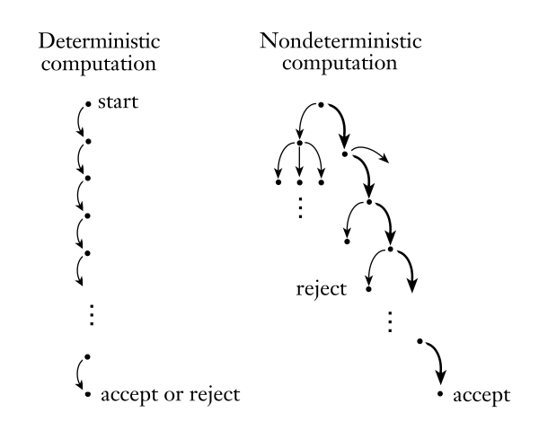
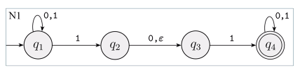
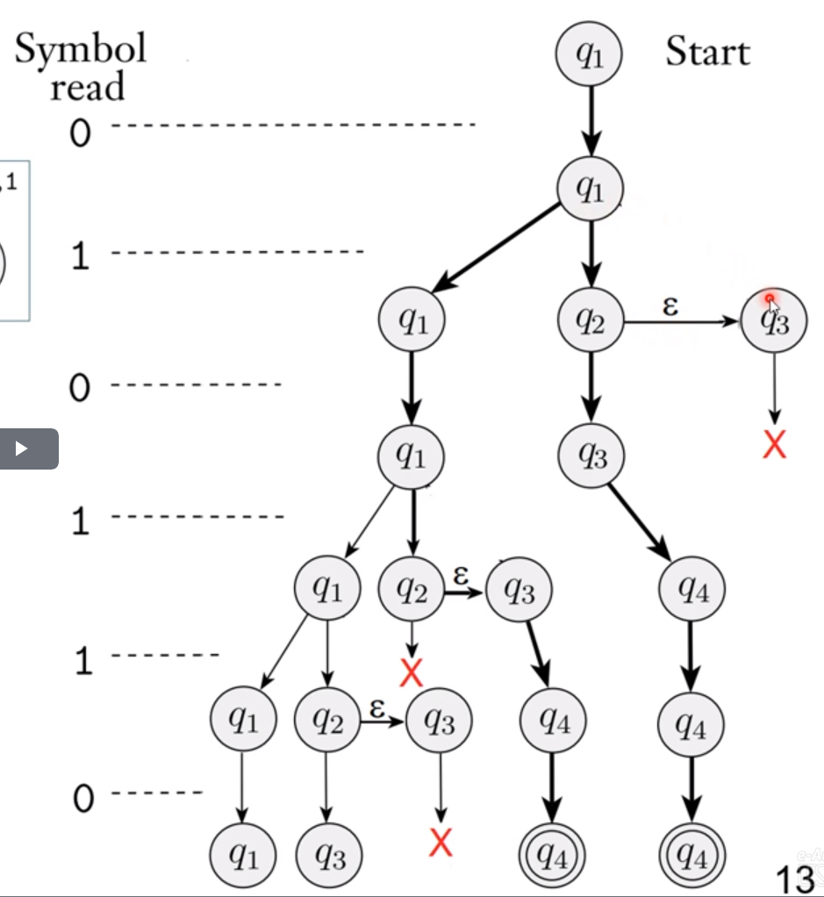

# Notas da aula 2

**Autômatos Finitos Não-determinísticos** (AFN), diferentemente de sua contraparte determinística AFD, vista anteriormente, possuem uma função de transição $\delta$ em que várias alternativas podem existir para o estado seguinte. Esta função, no mais, aceita também a cadeia vazia $\varepsilon$ como parte de seu alfabeto estendido $\Sigma_\varepsilon = \Sigma \cup \{\varepsilon\}$, tal que $\delta: Q \times \Sigma_\varepsilon \to \mathcal P(Q)$ é a definição formal da função  de transição. Onde $\mathcal P(Q)$ é o conjunto das partes (conjunto potência) de $Q$.

Sempre que um AFN se depara com um não-determinismo, este faz uma cópia de si (um "subautômato") e cada cópia segue com uma alternativa, em paralelo. Se uma das cópias aceitar a cadeia, então o AFN aceita a cadeia.

## Exemplo

Seja $M_1$ um autômato finito não-determinístico definido por $M_1 = (\{q_1, q_2, q_3, q_4\}, \{0,1\}, \delta, q_1, \{q_4\})$ onde

| $\bm \delta$ | 0         | 1              | $\bm\varepsilon$ |
| ------------ |:---------:|:--------------:|:----------------:|
| $q_1$        | $\{q_1\}$ | $\{q_1, q_2\}$ | $\empty$         |
| $q_2$        | $\{q_3\}$ | $\empty$       | $\{q_3\}$        |
| $q_3$        | $\empty$  | $\{q_4\}$      | $\empty$         |
| $q_4$        | $\{q_4\}$ | $\{q_4\}$      | $\empty$         |

> Onde $\empty$ indica que naquele dado *ramo* da computação que levou a este resultado a cadeia foi *rejeitada*.

Este pode ser esquematizado pelo seguinte diagrama:

Note que o estado $q_1$ apresenta múltiplos estados seguintes para o símbolo 1, e o estado $q_2$ apresenta um estado seguinte para a cadeia vazia. Uma **árvore de decisão** representativa do funcionamento deste autômato é a seguinte:

